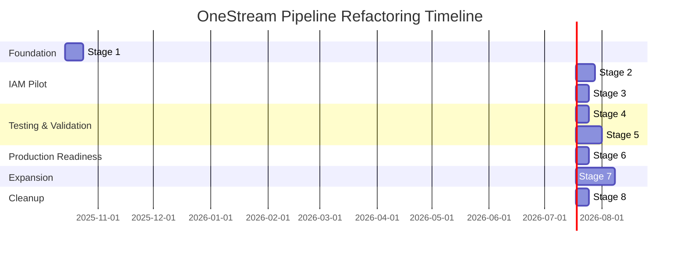
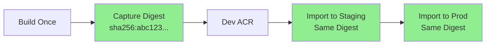
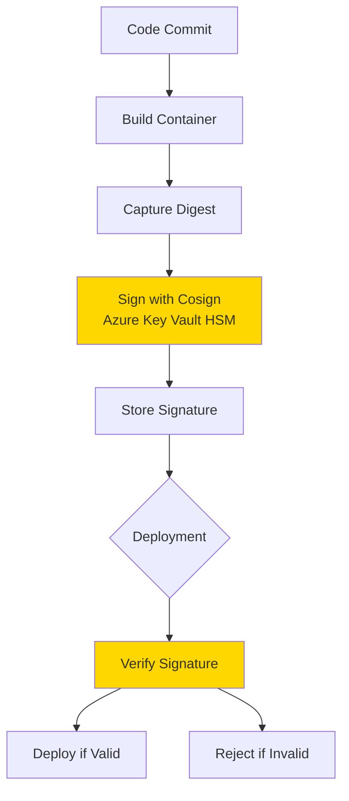
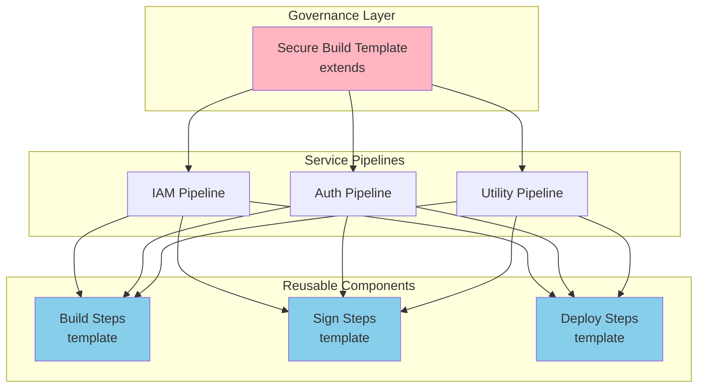
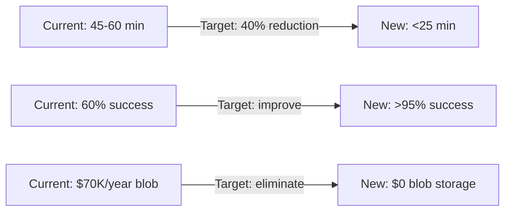
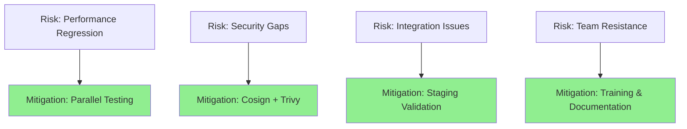

# OneStream Pipeline Refactoring Implementation Plan

## Overview

This folder contains a **staged implementation plan** for refactoring OneStream's monolithic pipeline into service-specific pipelines. Each stage is designed to be completed by a single engineer and includes detailed tasks, code samples, and architecture diagrams.

## Implementation Timeline

## Big Picture Architecture

```mermaid
graph TB
    subgraph "Current State - Monolithic"
        A1[Source Code] --> B1[Monolithic Pipeline<br/>600+ lines YAML]
        B1 --> C1[Blob Storage<br/>Complex checksums]
        C1 --> D1[Manual Download]
        D1 --> E1[ACR Push]
        E1 --> F1[AKS Deploy]
        
        style B1 fill:#ffcccc
        style C1 fill:#ffcccc
        style D1 fill:#ffcccc
    end
    
    subgraph "Target State - Service-Specific"
        A2[Source Code] --> B2[Service Pipeline<br/><150 lines YAML]
        B2 --> C2[Build & Test]
        C2 --> D2[Dev ACR<br/>Capture Digest]
        D2 --> E2[Cosign Sign<br/>Azure KV HSM]
        E2 --> F2[Direct ACR Import<br/>Staging/Prod]
        F2 --> G2[Verify Signature]
        G2 --> H2[Deploy by Digest]
        
        style B2 fill:#ccffcc
        style D2 fill:#ccffcc
        style E2 fill:#ccffcc
        style F2 fill:#ccffcc
    end
```

## Stage Overview

| Stage | Name | Duration | Engineer Focus | Key Deliverables |
|-------|------|----------|----------------|------------------|
| 1 | Foundation & Templates | 10 days | Pipeline Architecture | Template structure, variable management |
| 2 | IAM Service Pipeline | 10 days | Service Integration | IAM-specific pipeline, build automation |
| 3 | Digest & Signing | 7 days | Security Integration | Cosign integration, digest management |
| 4 | Testing Infrastructure | 7 days | Quality Engineering | Test frameworks, validation scripts |
| 5 | Parallel Testing | 14 days | DevOps/SRE | Performance validation, comparison |
| 6 | Production Deployment | 7 days | Release Engineering | Production rollout, monitoring |
| 7 | Service Expansion | 21 days | Service Teams | Replicate to other services |
| 8 | Legacy Decommission | 7 days | Platform Engineering | Cleanup, documentation |

## Stage Documents

Detailed implementation guides for each stage:

1. ✅ [Architecture Overview](./architecture-overview.md) - Complete architectural documentation
2. ✅ [Stage 1: Foundation & Templates](./stage-1-foundation-templates.md) - 7 days
3. ✅ [Stage 2: IAM Service Pipeline](./stage-2-iam-service-pipeline.md) - 10 days
4. [Stage 3: Digest Signing & Security](./stage-3-digest-signing.md) - 7 days
5. [Stage 4: Testing Infrastructure](./stage-4-testing-infrastructure.md) - 7 days
6. [Stage 5: Parallel Testing & Validation](./stage-5-parallel-testing.md) - 14 days
7. [Stage 6: Production Deployment](./stage-6-production-deployment.md) - 14 days
8. [Stage 7: Service Expansion](./stage-7-service-expansion.md) - 17 days
9. [Stage 8: Legacy Decommission](./stage-8-legacy-decommission.md) - 7 days

## Architecture Principles

### 1. Immutable Artifacts

**Key Concept**: Same binary from Dev → Staging → Prod (no rebuilds)

### 2. Cryptographic Trust Chain

**Key Concept**: Every deployment verifies cryptographic signatures before proceeding

### 3. Template-Based Standardization

**Key Concept**: Centralized governance with distributed execution

## Success Metrics

### Performance Improvements

### Quality Improvements
- **Security**: 100% signed containers with Cosign
- **Traceability**: Complete audit trail from commit to production
- **Reliability**: Independent service failures (reduced blast radius)
- **Maintainability**: <150 lines YAML per service vs 600+ monolithic

## Getting Started

### Prerequisites
- Azure DevOps organization access
- Azure subscription with ACR, Key Vault, AKS
- Service principal creation permissions
- Basic understanding of:
  - Azure DevOps YAML pipelines
  - Container registries and digests
  - Kubernetes deployments
  - Azure Key Vault

### Quick Start
1. Review the [Overall Architecture Document](./architecture-overview.md)
2. Start with [Stage 1: Foundation & Templates](./stage-1-foundation-templates.md)
3. Follow stages sequentially
4. Use code samples and adapt to your environment

## Risk Management

### Critical Success Factors
- ✅ **Parallel Testing**: Never turn off legacy until new is proven
- ✅ **Incremental Rollout**: Start with IAM, expand gradually
- ✅ **Rollback Plan**: Always maintain ability to revert
- ✅ **Stakeholder Buy-In**: Regular demos and progress updates

### Risk Mitigation

## Communication Plan

### Weekly Updates
- Progress against timeline
- Blockers and risks
- Success metrics
- Next week's focus

### Stage Completion Reviews
- Demo of functionality
- Performance comparison
- Lessons learned
- Go/no-go decision for next stage

## Support and Questions

- **Technical Questions**: Review stage-specific documentation
- **Architecture Decisions**: Refer to [Architecture Overview](./architecture-overview.md)
- **Code Samples**: Each stage includes working examples
- **Troubleshooting**: Common issues documented in each stage

---

**Project Status**: Ready to Begin
**Next Action**: Start with [Stage 1: Foundation & Templates](./stage-1-foundation-templates.md)
**Estimated Completion**: 83 days (approximately 4 months)
