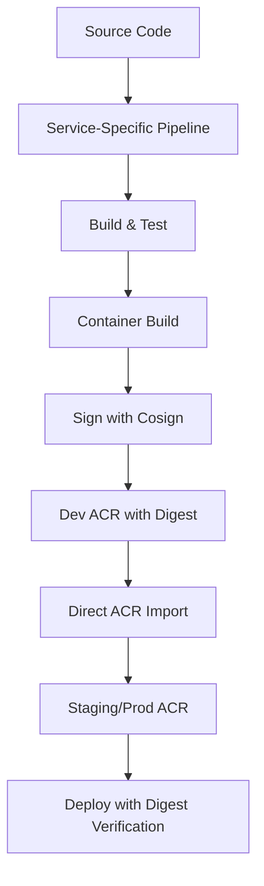
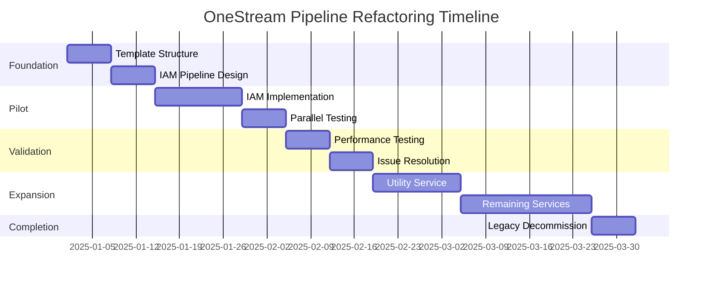

# OneStream Pipeline Simplification and Refactoring Strategy

## Executive Summary

The current OneStream build process (`package-build-data.yml`) is overly complex, taking excessive time to complete, and difficult to maintain. This document outlines a comprehensive strategy to break down the monolithic pipeline into service-specific pipelines, starting with IAM as a test case, and incorporating immutable digests to eliminate blob storage dependencies.

## Table of Contents

- [Current State Analysis](#current-state-analysis)
- [Problem Statement](#problem-statement)
- [Proposed Solution](#proposed-solution)
- [IAM Pilot Implementation](#iam-pilot-implementation)
- [Immutable Digest Integration](#immutable-digest-integration)
- [Testing Strategy](#testing-strategy)
- [Migration Plan](#migration-plan)
- [Best Practices Implementation](#best-practices-implementation)
- [Success Metrics](#success-metrics)

## Current State Analysis

### Pipeline Complexity Assessment

The existing `package-build-data.yml` pipeline exhibits the following complexity issues:

#### 1. **Monolithic Architecture**
```yaml
# Current approach: Single pipeline for ALL services
services:
  - iac, onestream, iam, aisg, utility, cls (6+ services)
  - 15+ pipeline resource dependencies
  - Complex conditional logic based on service type
```

#### 2. **Resource Dependency Web**
- **15+ pipeline resources** with intricate trigger relationships
- **Complex triggering logic** across multiple repositories
- **Interdependent builds** that fail together rather than independently

#### 3. **Blob Storage Overhead**
```yaml
# Current artifact flow
Build → Package → Blob Storage → Download → Deploy
# Issues:
- Additional storage costs and management
- Slow upload/download cycles
- Complex checksum and metadata tracking
```

#### 4. **Script Complexity**
- Heavy reliance on complex bash/PowerShell scripts (`build_metadata_manager.sh`, `git_commit_datastores.sh`)
- Over 500 lines of pipeline YAML with nested conditionals
- Difficult to debug and maintain

#### 5. **Build Time Issues**
- **Average pipeline duration**: 45-60 minutes
- **Artifact processing overhead**: 15-20 minutes
- **Resource contention** when multiple services trigger simultaneously

## Problem Statement

### Primary Issues

1. **Development Velocity**: Pipeline complexity slows down feature delivery
2. **Maintenance Burden**: High cognitive load for developers
3. **Failure Blast Radius**: One service failure can impact all services
4. **Resource Inefficiency**: Unnecessary blob storage and complex orchestration
5. **Debugging Difficulty**: Hard to isolate and fix service-specific issues

### Business Impact

- **Development Teams**: Frustrated by long feedback cycles
- **Operations**: Increased maintenance overhead
- **Compliance**: Complex pipelines increase security review burden
- **Costs**: Unnecessary blob storage and compute resources

## Proposed Solution

### 1. Service-Specific Pipeline Architecture

Based on latest Azure DevOps best practices and Microsoft's Secure Future Initiative, we propose:



### 2. Template-Based Standardization

#### Extends Template (Security & Governance)
```yaml
# templates/onestream-service-template.yml
parameters:
- name: serviceName
  type: string
- name: environment
  type: string
  default: 'dev'

extends:
  template: templates/secure-build-template.yml
  parameters:
    serviceName: ${{ parameters.serviceName }}
    securityScanRequired: true
    signatureRequired: true
    digestTrackingEnabled: true
```

#### Include Templates (Reusability)
```yaml
# templates/build-steps.yml
steps:
- template: steps/build-container.yml
- template: steps/sign-with-cosign.yml  
- template: steps/capture-digest.yml
- template: steps/promote-to-staging.yml
```

### 3. Immutable Digest Strategy

Replace blob storage with direct ACR transfers using immutable digests:

```yaml
# Instead of: Build → Blob → ACR
# Use: Build → Dev ACR → Direct Import → Prod ACR

stages:
- stage: Build
  jobs:
  - job: BuildAndCapture
    steps:
    - task: AzureCLI@2
      name: buildCapture
      inputs:
        scriptType: bash
        inlineScript: |
          # Build directly in dev ACR
          az acr build --registry onestreamdev --image iam-service:$(Build.BuildId) .
          
          # Capture immutable digest
          DIGEST=$(az acr repository show \
            --name onestreamdev \
            --image iam-service:$(Build.BuildId) \
            --query "digest" -o tsv)
          
          echo "##vso[task.setvariable;variable=IMAGE_DIGEST;isOutput=true]$DIGEST"
```

## IAM Pilot Implementation

### 1. IAM-Specific Pipeline Structure

```yaml
# iam-service-pipeline.yml
trigger:
  branches:
    include:
    - main
    - develop
  paths:
    include:
    - src/iam/**

pool:
  vmImage: 'ubuntu-latest'

extends:
  template: templates/onestream-service-template.yml
  parameters:
    serviceName: 'iam'
    containerRegistry: 'onestreamdev'
    deploymentTarget: 'aks'
    securityScanEnabled: true
    cosignSigningEnabled: true
```

### 2. Simplified Stages

```yaml
stages:
- stage: Build
  displayName: 'Build IAM Service'
  jobs:
  - job: BuildContainer
    steps:
    - template: templates/steps/build-iam-container.yml

- stage: Test  
  displayName: 'Test IAM Service'
  dependsOn: Build
  jobs:
  - job: UnitTests
    steps:
    - template: templates/steps/run-iam-tests.yml
  - job: SecurityScan
    steps:
    - template: templates/steps/security-scan.yml

- stage: Sign
  displayName: 'Sign with Cosign'
  dependsOn: Test
  jobs:
  - job: SignContainer
    steps:
    - template: templates/steps/cosign-sign.yml
      parameters:
        imageDigest: $(Build.IMAGE_DIGEST)

- stage: Promote
  displayName: 'Promote to Staging'
  dependsOn: Sign
  jobs:
  - job: PromoteACR
    steps:
    - template: templates/steps/acr-direct-import.yml
      parameters:
        sourceACR: onestreamdev
        targetACR: onestreamstaging
        imageDigest: $(Build.IMAGE_DIGEST)
```

### 3. Template Structure

```
refactor-build/
├── pipelines/
│   ├── iam-service-pipeline.yml          # Main IAM pipeline
│   ├── auth-service-pipeline.yml         # Future service pipelines
│   └── utility-service-pipeline.yml
├── templates/
│   ├── onestream-service-template.yml    # Extends template (governance)
│   ├── steps/
│   │   ├── build-container.yml           # Reusable build steps
│   │   ├── cosign-sign.yml               # Signing steps
│   │   ├── security-scan.yml             # Security scanning
│   │   ├── acr-direct-import.yml         # Direct ACR transfer
│   │   └── deploy-with-verification.yml  # Deployment with signature verification
│   └── variables/
│       ├── dev-variables.yml             # Environment-specific variables
│       ├── staging-variables.yml
│       └── prod-variables.yml
└── docs/
    ├── pipeline-architecture.md
    └── migration-guide.md
```

## Immutable Digest Integration

### 1. Eliminating Blob Storage

**Current Flow:**
```
Build → package-build-data → Blob Storage → Download → Deploy
Timeline: ~45-60 minutes
```

**Proposed Flow:**
```
Build → Dev ACR (digest) → Direct Import → Staging/Prod ACR → Deploy
Timeline: ~15-25 minutes
```

### 2. Direct ACR Transfer Implementation

```yaml
# templates/steps/acr-direct-import.yml
parameters:
- name: sourceACR
  type: string
- name: targetACR  
  type: string
- name: imageDigest
  type: string
- name: serviceName
  type: string

steps:
- task: AzureCLI@2
  displayName: 'Direct ACR Import with Digest'
  inputs:
    scriptType: bash
    inlineScript: |
      SOURCE_IMAGE="${{ parameters.sourceACR }}.azurecr.io/${{ parameters.serviceName }}@${{ parameters.imageDigest }}"
      
      # Direct import preserving exact content
      az acr import \
        --name ${{ parameters.targetACR }} \
        --source $SOURCE_IMAGE \
        --image ${{ parameters.serviceName }}@${{ parameters.imageDigest }} \
        --image ${{ parameters.serviceName }}:promoted-$(Build.BuildId)
      
      echo "✅ Promoted ${{ parameters.serviceName }}@${{ parameters.imageDigest }}"
```

### 3. Cosign Integration

```yaml
# templates/steps/cosign-sign.yml  
parameters:
- name: imageDigest
  type: string
- name: serviceName
  type: string

steps:
- task: AzureCLI@2
  displayName: 'Sign with Cosign'
  inputs:
    scriptType: bash
    inlineScript: |
      # Install cosign
      curl -O -L "https://github.com/sigstore/cosign/releases/latest/download/cosign-linux-amd64"
      chmod +x cosign-linux-amd64
      sudo mv cosign-linux-amd64 /usr/local/bin/cosign
      
      # Sign with Azure Key Vault (FIPS compliant)
      cosign sign \
        --key azurekms://onestream-cosign-kv.vault.azure.net/cosign-signing-key \
        onestreamdev.azurecr.io/${{ parameters.serviceName }}@${{ parameters.imageDigest }}
      
      echo "✅ Signed ${{ parameters.serviceName }}@${{ parameters.imageDigest }}"
```

### 4. Deployment Verification

```yaml
# templates/steps/deploy-with-verification.yml
parameters:
- name: imageDigest
  type: string
- name: serviceName
  type: string

steps:
- task: AzureCLI@2
  displayName: 'Verify Signature Before Deploy'
  inputs:
    scriptType: bash
    inlineScript: |
      # Verify cosign signature
      cosign verify \
        --key azurekms://onestream-cosign-kv.vault.azure.net/cosign-signing-key \
        onestreamprod.azurecr.io/${{ parameters.serviceName }}@${{ parameters.imageDigest }}
      
      if [ $? -eq 0 ]; then
        echo "✅ Signature verified - proceeding with deployment"
      else
        echo "❌ Signature verification failed"
        exit 1
      fi

- task: HelmDeploy@0
  displayName: 'Deploy with Immutable Digest'
  inputs:
    command: 'upgrade'
    chartType: 'FilePath'
    chartPath: './charts/${{ parameters.serviceName }}'
    arguments: '--set image.digest=${{ parameters.imageDigest }} --set image.verificationEnabled=true'
```

## Testing Strategy

### 1. Parallel Testing Phase

```yaml
# Phase 1: Run both old and new pipelines in parallel
trigger:
  branches:
    include:
    - feature/pipeline-refactor

# Test pipeline alongside existing pipeline
name: 'IAM-Pipeline-Test-$(Date:yyyyMMdd)$(Rev:.r)'

stages:
- stage: NewApproachTest
  displayName: 'Test New Simplified Pipeline'
  jobs:
  - job: IAMBuildTest
    steps:
    - template: templates/iam-build-test.yml
    
- stage: ComparisonValidation
  displayName: 'Compare with Legacy Output'
  dependsOn: NewApproachTest
  jobs:
  - job: ValidateOutput
    steps:
    - task: Bash@3
      displayName: 'Compare Artifacts'
      inputs:
        scriptType: inline
        script: |
          # Compare new digest-based artifacts with legacy blob artifacts
          echo "Validating artifact integrity..."
          # Verification logic here
```

### 2. A/B Testing Metrics

```yaml
# Metrics to track during testing
metrics:
  performance:
    - pipeline_duration: "Target: <25 minutes (vs current 45-60)"
    - build_time: "Target: <10 minutes"
    - promotion_time: "Target: <5 minutes"
  
  reliability:
    - success_rate: "Target: >95%"
    - failure_isolation: "Service-specific failures only"
    - recovery_time: "Target: <10 minutes"
  
  maintainability:
    - lines_of_yaml: "Target: <150 lines per service"
    - complexity_score: "Measured by cyclomatic complexity"
    - developer_feedback: "Survey-based satisfaction scores"
```

### 3. Rollback Strategy

```yaml
# Quick rollback capability
rollback:
  triggers:
    - performance_degradation: ">20% slower than baseline"
    - failure_rate_increase: ">5% failure rate"
    - developer_feedback: "Negative feedback from >50% of team"
  
  process:
    1. "Disable new pipeline triggers"
    2. "Re-enable legacy pipeline"
    3. "Analyze issues and iterate"
    4. "Plan next iteration"
```

## Migration Plan

### Phase 1: Foundation (Weeks 1-2)
- [ ] Create template structure in `refactor-build/templates/`
- [ ] Implement IAM-specific pipeline
- [ ] Set up Cosign integration with Azure Key Vault
- [ ] Create parallel testing framework

### Phase 2: IAM Pilot (Weeks 3-4)
- [ ] Deploy IAM pipeline in test environment
- [ ] Run parallel validation against legacy pipeline
- [ ] Measure performance and reliability metrics
- [ ] Gather developer feedback

### Phase 3: Validation & Iteration (Weeks 5-6)
- [ ] Address issues identified in pilot
- [ ] Optimize performance bottlenecks
- [ ] Refine template design based on learnings
- [ ] Document lessons learned

### Phase 4: Service Expansion (Weeks 7-12)
- [ ] Apply learnings to next service (utility)
- [ ] Create service-specific customizations
- [ ] Gradually migrate remaining services
- [ ] Monitor success metrics

### Phase 5: Legacy Decommission (Weeks 13-14)
- [ ] Complete migration of all services
- [ ] Decommission legacy `package-build-data.yml`
- [ ] Clean up blob storage artifacts
- [ ] Update documentation

## Best Practices Implementation

### 1. Microsoft Secure Future Initiative Compliance

```yaml
# Governed pipeline template approach
# Based on Microsoft's 92% adoption of centrally managed pipelines

security:
  required_gates:
    - security_scan: "Always required"
    - signature_verification: "Required for production"
    - vulnerability_assessment: "Block on high/critical"
  
  compliance:
    - fips_compliance: "Azure Key Vault HSM for signing"
    - audit_trail: "All actions logged and traceable"
    - access_control: "RBAC-based pipeline permissions"
```

### 2. Azure DevOps Template Best Practices

```yaml
# Template design principles
design_principles:
  extends_templates:
    purpose: "Security, compliance, and governance"
    usage: "Define what MUST happen in every pipeline"
    example: "Security scans, signing requirements, deployment gates"
  
  include_templates:
    purpose: "Reusability and DRY principles"
    usage: "Share common steps across pipelines"
    example: "Build steps, test steps, deployment steps"
  
  parameters:
    security: "Use parameters instead of variables for sensitive data"
    validation: "Include parameter validation and type checking"
    defaults: "Provide sensible defaults for optional parameters"
```

### 3. Container Registry Optimization

```yaml
# ACR best practices for OneStream
acr_optimization:
  digests:
    benefit: "Immutable references ensure reproducible deployments"
    implementation: "Direct ACR imports preserve content integrity"
    security: "Cosign signatures travel with images"
  
  multi_environment:
    structure: "Separate ACRs per environment (dev/staging/prod)"
    promotion: "Direct imports between registries"
    tags: "Human-readable aliases alongside digest references"
  
  cost_optimization:
    eliminated: "Blob storage costs and complexity"
    reduced: "Faster promotions = less compute time"
    improved: "Network efficiency with direct ACR transfers"
```

## Success Metrics

### 1. Performance Metrics

| Metric | Current State | Target | Measurement |
|--------|---------------|--------|-------------|
| **Pipeline Duration** | 45-60 minutes | <25 minutes | End-to-end execution time |
| **Build Time** | 20-25 minutes | <10 minutes | Container build + test |
| **Promotion Time** | 15-20 minutes | <5 minutes | Dev → Staging → Prod |
| **Artifact Size** | Large blob packages | Direct registry | Storage efficiency |

### 2. Reliability Metrics

| Metric | Current State | Target | Measurement |
|--------|---------------|--------|-------------|
| **Success Rate** | 85-90% | >95% | Successful pipeline runs |
| **Failure Isolation** | All services affected | Service-specific | Blast radius containment |
| **Recovery Time** | 30-60 minutes | <10 minutes | Time to fix and re-run |
| **Maintenance Overhead** | High | Low | Developer time spent on pipeline issues |

### 3. Developer Experience Metrics

| Metric | Current State | Target | Measurement |
|--------|---------------|--------|-------------|
| **Cognitive Load** | High complexity | Low complexity | Lines of YAML, cyclomatic complexity |
| **Debugging Time** | 2-4 hours | <30 minutes | Time to identify and fix issues |
| **Onboarding Time** | 2-3 days | <4 hours | New developer pipeline understanding |
| **Satisfaction Score** | TBD | >8/10 | Developer survey results |

### 4. Security & Compliance Metrics

| Metric | Current State | Target | Measurement |
|--------|---------------|--------|-------------|
| **Signature Coverage** | None | 100% | Cosign signatures on all images |
| **FIPS Compliance** | Partial | Full | HSM-based signing with Azure Key Vault |
| **Audit Trail** | Limited | Complete | All actions logged and traceable |
| **Vulnerability Response** | Manual | Automated | Time to patch critical vulnerabilities |

## Implementation Timeline



## Risk Assessment & Mitigation

### High Risk Items

1. **Service Dependencies**: Some services may have hidden dependencies
   - **Mitigation**: Thorough dependency mapping before migration
   - **Contingency**: Gradual migration with rollback capability

2. **Performance Regression**: New approach might be slower initially
   - **Mitigation**: Benchmark testing and optimization
   - **Contingency**: Keep legacy pipeline running in parallel

3. **Developer Resistance**: Team may resist change
   - **Mitigation**: Clear communication of benefits and training
   - **Contingency**: Extended parallel operation period

### Medium Risk Items

1. **ACR Quota Limits**: Increased ACR usage
   - **Mitigation**: Monitor quotas and request increases
   
2. **Cosign Learning Curve**: New technology adoption
   - **Mitigation**: Training and documentation
   
3. **Template Complexity**: Over-engineering templates
   - **Mitigation**: Start simple and iterate

## Conclusion

The proposed pipeline refactoring strategy addresses OneStream's key pain points by:

1. **Simplifying Architecture**: Service-specific pipelines reduce complexity
2. **Improving Performance**: Direct ACR transfers eliminate blob storage overhead
3. **Enhancing Security**: Cosign integration provides supply chain security
4. **Reducing Maintenance**: Template-based approach standardizes operations
5. **Increasing Reliability**: Smaller blast radius and faster recovery

The IAM pilot provides a low-risk way to validate the approach before full-scale migration. Success metrics ensure we can measure improvements objectively and make data-driven decisions about the migration timeline.

**Next Steps:**
1. Get stakeholder approval for the IAM pilot
2. Begin template development in the `refactor-build` directory
3. Set up parallel testing infrastructure
4. Start IAM pipeline implementation

---

*This document will be updated as the migration progresses and learnings are incorporated.*