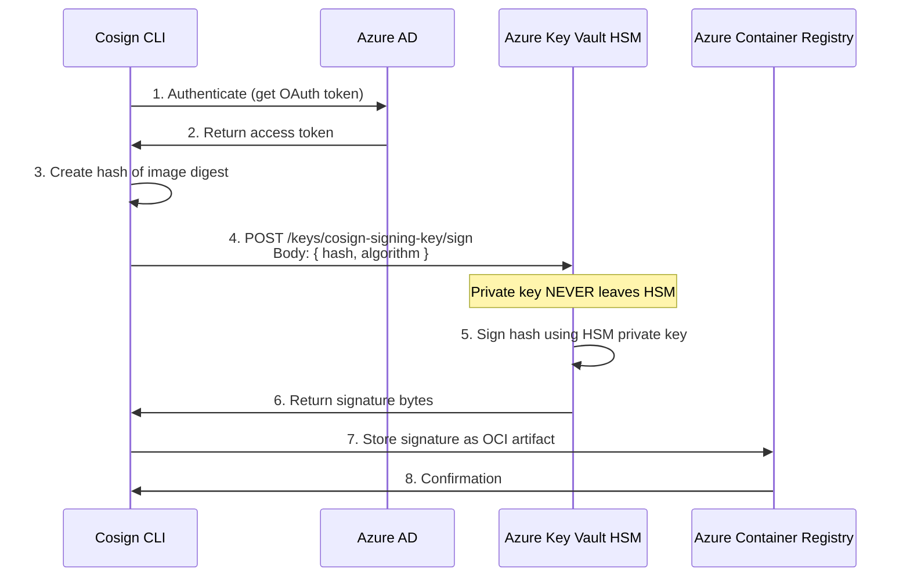

## How Azure KMS Integration Works

### **What Gets Transmitted:**
1. **Authentication tokens** (Azure AD OAuth tokens)
2. **Hash of the image digest** to be signed
3. **Signature result** (returned from Azure Key Vault)
4. **Metadata** (key version, algorithm, etc.)

### **What NEVER Gets Transmitted:**
- ❌ **Private key material**
- ❌ **Key contents/bytes**
- ❌ **Decrypted key data**

## Step-by-Step Process

```bash
cosign sign \
  --key azurekms://onestream-cosign-kv.vault.azure.net/cosign-signing-key \
  onestreamdev.azurecr.io/iam/service@sha256:abc123def456...
```

### **What Happens Behind the Scenes:**



### **Detailed Network Traffic:**

```bash
# 1. Authentication Request
POST https://login.microsoftonline.com/tenant-id/oauth2/v2.0/token
Content-Type: application/x-www-form-urlencoded
Body: grant_type=client_credentials&client_id=...&scope=https://vault.azure.net/.default

# 2. Signing Request to Key Vault
POST https://onestream-cosign-kv.vault.azure.net/keys/cosign-signing-key/sign?api-version=7.3
Authorization: Bearer <access-token>
Content-Type: application/json
Body: {
  "alg": "RS256",
  "value": "eyJhbGciOiJSUzI1NiIsInR5cCI6IkpXVCJ9..."  # Hash of digest, not key!
}

# 3. Response from Key Vault
HTTP/200 OK
Content-Type: application/json
Body: {
  "kid": "https://onestream-cosign-kv.vault.azure.net/keys/cosign-signing-key/version",
  "value": "signature-bytes-here"  # Signature result, not private key!
}
```

## Security Benefits of Azure Key Vault HSM

### **1. Private Key Isolation**
```yaml
Security Properties:
  - Private key NEVER leaves HSM boundary
  - HSM is FIPS 140-2 Level 2 validated
  - Tamper-resistant hardware security module
  - Zero-knowledge architecture (Azure can't see your keys)
```

### **2. Network Security**
```yaml
Network Transmission:
  ✅ Only signature operations over HTTPS
  ✅ Authentication tokens (OAuth 2.0)
  ✅ Hash values and signature results
  ❌ Never private key material
  ❌ Never decrypted key data
```

### **3. Audit Trail**
```bash
# Azure Key Vault logs show operations, not key material
{
  "time": "2025-09-30T10:00:00Z",
  "operationName": "VaultSign",
  "resourceId": "/subscriptions/.../vaults/onestream-cosign-kv/keys/cosign-signing-key",
  "category": "AuditEvent",
  "properties": {
    "clientInfo": "cosign/v2.2.0",
    "requestUri": "https://onestream-cosign-kv.vault.azure.net/keys/cosign-signing-key/sign",
    "algorithm": "RS256",
    "keyVersion": "abc123",
    # No key material logged!
  }
}
```

## Comparison with Other Approaches

### **Local Key File (INSECURE for production):**
```bash
# With local key - private key IS transmitted/stored locally
cosign sign --key cosign.key image@digest
# ❌ Private key exists on filesystem
# ❌ Key material could be transmitted in CI/CD
# ❌ Risk of key exposure
```

### **Azure Key Vault KMS (SECURE):**
```bash
# With Azure KMS - private key NEVER leaves HSM
cosign sign --key azurekms://vault.../key image@digest
# ✅ Private key stays in HSM
# ✅ Only API calls for signing operations
# ✅ FIPS 140-2 Level 2 protection
```

## OneStream Pipeline Security

### **In Your Pipeline:**
```yaml
- task: AzureCLI@2
  displayName: 'Sign Image with Azure KV'
  inputs:
    scriptType: 'bash'
    inlineScript: |
      # This command does NOT transmit private key
      cosign sign \
        --key azurekms://onestream-cosign-kv.vault.azure.net/cosign-signing-key \
        $(ACR_NAME).azurecr.io/$(SERVICE_NAME)@$(IMAGE_DIGEST)
      
      # Network traffic contains:
      # ✅ Azure AD auth tokens
      # ✅ Hash of image digest  
      # ✅ Signature result
      # ❌ NO private key material
```

### **What the Pipeline Agent Needs:**
```yaml
Required Permissions:
  - Azure AD authentication (via service principal or managed identity)
  - Key Vault "Key Vault Crypto User" role
  - ACR push permissions for storing signatures

NOT Required:
  - ❌ Private key files
  - ❌ Key export permissions
  - ❌ Local key storage
```

## Verification Process

### **Public Key Extraction (Safe):**
```bash
# Extract public key for verification (this is safe to transmit)
cosign public-key \
  --key azurekms://onestream-cosign-kv.vault.azure.net/cosign-signing-key \
  > cosign-public-key.pem

# Public key can be safely:
# ✅ Stored in Kubernetes secrets
# ✅ Transmitted over network
# ✅ Shared with verification systems
# ✅ Committed to git (if desired)
```

## Summary

When using `--key azurekms://...` with Cosign:

1. **Private key NEVER leaves Azure Key Vault HSM**
2. **Only signing operations are performed remotely**
3. **Network traffic contains authentication, hashes, and signatures**
4. **FIPS 140-2 Level 2 hardware protection**
5. **Zero-knowledge architecture - even Microsoft can't see your private keys**

This is why Azure Key Vault integration is recommended for OneStream's security and compliance requirements - it provides the highest level of key protection while enabling automated signing in CI/CD pipelines.