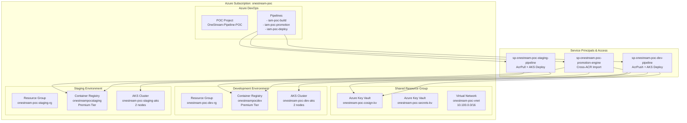
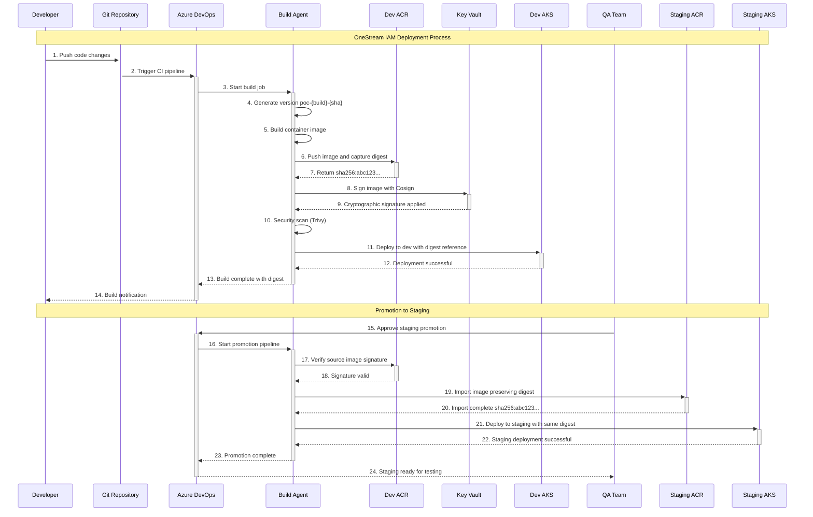
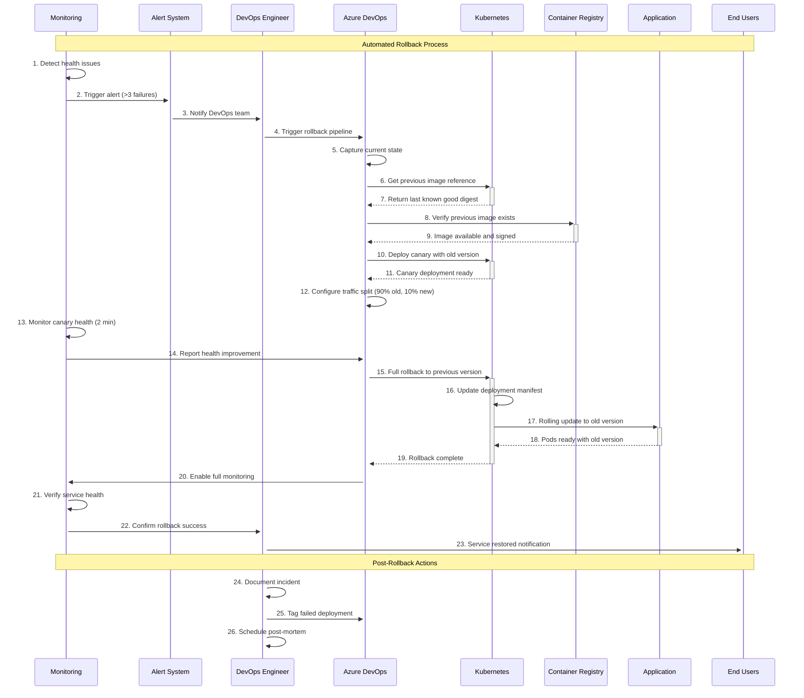

# OneStream POC Environment Visio Diagrams

## Diagram 1: POC Environment Architecture

### Components and Layout

### Visio Layout Instructions

**Page Setup:**
- Page Size: 11" x 17" (Tabloid)
- Orientation: Landscape
- Scale: 1:1

**Color Scheme:**
- Azure Blue (#0078D4) for Azure services
- Light Gray (#F8F8F8) for resource group boundaries
- Dark Gray (#666666) for service principals
- Green (#107C10) for development components
- Orange (#FF8C00) for staging components

**Stencils to Use:**
- Azure Icon Set (from Microsoft)
- Network and Security stencils
- Containers and Kubernetes stencils

**Component Details:**

1. **Azure Subscription Container** (Large rectangle, light blue border)
   - Title: "Azure Subscription: onestream-poc"
   - Subtitle: "Isolated POC Environment"

2. **Resource Group Containers** (Medium rectangles, dashed borders)
   - onestream-poc-shared-rg (Gray)
   - onestream-poc-dev-rg (Light Green)
   - onestream-poc-staging-rg (Light Orange)

3. **Azure Services** (Standard Azure icons)
   - Key Vault icons with names and purposes
   - Container Registry icons with tiers
   - AKS icons with node counts
   - Virtual Network icon with CIDR

4. **Service Principal Actors** (User icons with gear overlay)
   - Color-coded by environment access
   - Permission labels beneath each

5. **Connection Lines**
   - Solid lines for direct access
   - Dashed lines for promotional flows
   - Different colors for different permission types

## Diagram 2: Deployment Process Flow

### Numbered Process Steps

### Visio Layout Instructions for Deployment Process

**Page Setup:**
- Page Size: 11" x 17" (Tabloid)
- Orientation: Landscape
- Swimlane layout

**Swimlanes (Top to Bottom):**
1. **Developer** (Light Blue background)
2. **Git Repository** (Gray background)
3. **Azure DevOps** (Blue background)
4. **Build Process** (Green background)
5. **Development Environment** (Light Green background)
6. **Staging Environment** (Light Orange background)
7. **QA/Approvers** (Yellow background)

**Process Steps with Numbers:**

1. **Code Push** (Blue arrow, Developer → Git)
2. **CI Trigger** (Straight arrow, Git → Azure DevOps)
3. **Build Start** (Green arrow, Azure DevOps → Build)
4. **Version Generation** (Internal process box)
5. **Container Build** (Internal process box)
6. **ACR Push** (Arrow with container icon)
7. **Digest Capture** (Return arrow with hash symbol)
8. **Cosign Signing** (Arrow to Key Vault icon)
9. **Signature Applied** (Return arrow with lock icon)
10. **Security Scan** (Internal process with shield icon)
11. **Dev Deploy** (Arrow to AKS with digest label)
12. **Deploy Success** (Green checkmark return)
13. **Build Complete** (Success notification)
14. **Developer Notification** (Bell icon)
15. **QA Approval** (Manual approval gate)
16. **Promotion Start** (New pipeline trigger)
17. **Signature Verify** (Verification step)
18. **Signature Valid** (Green checkmark)
19. **ACR Import** (Cross-environment arrow)
20. **Import Complete** (Success with same digest)
21. **Staging Deploy** (Arrow to staging AKS)
22. **Deploy Success** (Green checkmark)
23. **Promotion Complete** (Final success)
24. **QA Notification** (Ready for testing)

## Diagram 3: Rollback Process Flow

### Numbered Rollback Steps

### Visio Layout Instructions for Rollback Process

**Page Setup:**
- Page Size: 11" x 17" (Tabloid)
- Orientation: Portrait
- Timeline layout with decision diamonds

**Key Actors (Left side, vertical layout):**
1. **Monitoring System** (Computer with graph icon)
2. **Alert System** (Bell with exclamation)
3. **DevOps Engineer** (Person with gear icon)
4. **Azure DevOps** (Azure logo)
5. **Kubernetes** (K8s logo)
6. **Container Registry** (Container icon)
7. **Application** (App icon)
8. **End Users** (Multiple person icons)

**Process Flow (Right side, numbered steps):**

**Detection Phase (Red background):**
1. Health monitoring detects issues
2. Alert threshold exceeded
3. DevOps team notified

**Decision Diamond:** "Manual or Auto Rollback?"

**Rollback Execution (Orange background):**
4. Trigger rollback pipeline
5. Capture current deployment state
6. Retrieve previous version reference
7. Verify previous image availability
8. Deploy canary with old version
9. Configure traffic splitting

**Monitoring Phase (Yellow background):**
10. Monitor canary health
11. Evaluate rollback success
12. Decision diamond: "Health improved?"

**Completion Phase (Green background):**
13. Execute full rollback
14. Update deployment manifests
15. Rolling update to previous version
16. Verify pod readiness
17. Confirm rollback completion
18. Enable monitoring
19. Verify service health
20. Notify stakeholders

**Post-Incident (Blue background):**
21. Document incident
22. Tag failed deployment
23. Schedule post-mortem
24. Update runbooks

**Time Indicators:**
- Total process time: < 5 minutes
- Detection to action: < 30 seconds
- Rollback execution: < 3 minutes
- Verification: < 2 minutes

### Component Legend for All Diagrams

**Icons and Symbols:**
- 🔵 Azure Services (Blue circles)
- 🟢 Development Environment (Green squares)
- 🟠 Staging Environment (Orange squares)
- 🔴 Production/Critical (Red squares)
- ⚡ Automated Process (Lightning bolt)
- 👤 Human Actor (Person icon)
- 🔒 Security Component (Lock icon)
- 📊 Monitoring (Graph icon)
- ⚠️ Alert/Warning (Triangle with exclamation)
- ✅ Success State (Green checkmark)
- ❌ Failure State (Red X)

**Connection Types:**
- **Solid Arrow:** Direct action/communication
- **Dashed Arrow:** Conditional/approval required
- **Double Arrow:** Bidirectional communication
- **Thick Arrow:** High-priority/critical path
- **Dotted Line:** Monitoring/passive observation

## Export Instructions for Visio

1. **Create New Visio Document**
   - Template: "Basic Network Diagram" or "Cross-functional Flowchart"
   - Enable shape data fields for metadata

2. **Import Azure Stencils**
   - Download Microsoft Azure icons pack
   - Add Kubernetes icons if available

3. **Layer Organization**
   - Background layer: Grid and labels
   - Infrastructure layer: Azure resources
   - Process layer: Workflow arrows and steps
   - Annotation layer: Numbers and descriptions

4. **Shape Data Properties**
   - Add custom properties for each component:
     - Service Principal permissions
     - Resource configurations
     - Process timing
     - Approval requirements

5. **Export Options**
   - Save as .vsdx for editing
   - Export as PDF for presentations
   - Export as SVG for web use
   - Export as PNG for documentation

This provides you with detailed specifications to create professional Visio diagrams that clearly show the POC environment architecture, deployment process, and rollback procedures with all key actors and numbered steps.