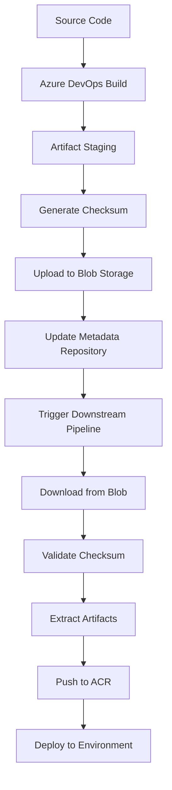

# Storage Account Impact Analysis

## Overview

This document provides a comprehensive analysis of the impact of removing the Azure Storage Account for intermediate artifacts in OneStream's CI/CD pipeline refactoring initiative. The analysis examines current usage patterns, migration benefits, risks, and provides actionable recommendations.

## Current Storage Account Usage Analysis

### Current Blob Storage Pattern

Looking at the legacy `package-build-data.yml` pipeline, the storage account is heavily integrated into the build and deployment workflow:

```yaml
# Current flow: Build → Blob Storage → ACR → Deploy
- Build artifacts in Azure DevOps
- Upload to blob storage (artifacts container)
- Download from blob for ACR operations
- Complex checksum management
- Multi-stage artifact promotion
```

### Key Storage Operations in Legacy Pipeline

#### 1. Artifact Upload and Management
```yaml
# Example from package-build-data.yml
- task: AzureCLI@2
  displayName: Upload artifacts to blob storage
  inputs:
    scriptType: bash
    scriptLocation: inlineScript
    inlineScript: |
      az storage copy \
        --source "$(Build.ArtifactStagingDirectory)/${{ service.name }}" \
        --destination 'https://$(source_artifact_storage).blob.core.windows.net/artifacts/${{ service.name }}/$(version)/' \
        --recursive
```

**Services Currently Using Blob Storage:**
- **IAC Service**: Infrastructure artifacts and Terraform plans
- **OneStream Platform**: Application binaries and configurations
- **IAM Service**: Identity and access management artifacts
- **AISG Service**: AI/ML model artifacts and containers
- **Utility Service**: Shared utility components
- **CLS Service**: Legacy container lifecycle artifacts
- **External Services**: Third-party Helm charts and images (15+ services)

#### 2. Checksum and Integrity Management
```yaml
# Checksum workflow from legacy pipeline
- task: AzureCLI@2
  displayName: Generate Checksum
  name: generate_checksum
  inputs:
    scriptPath: $(Build.SourcesDirectory)/.azure-pipelines/scripts/generate_checksum.ps1
  env:
    WORKING_DIR: $(Build.ArtifactStagingDirectory)/${{ service.name }}

- task: AzureCLI@2
  displayName: Commit Checksum to Metadata Repository
  inputs:
    scriptPath: $(Build.SourcesDirectory)/.azure-pipelines/scripts/git_commit_checksum.sh
    arguments: |
      $(System.TeamFoundationCollectionUri) 
      main 
      "package-build-data:${{ service.name }}-checksum" 
      "$(version)-$(Build.BuildId)"
  env:
    SOURCE_DIR: $(Build.ArtifactStagingDirectory)/${{ service.name }}
    REPO_TARGET_PATH: $(System.DefaultWorkingDirectory)/$(Metadata)/$(deploy_blob)/${{ service.name }}/$(version)
    CHECKSUM_FILENAME: checksum
```

#### 3. Multi-Environment Artifact Promotion
```yaml
# Environment-specific blob paths
variables:
  - ${{ if parameters.release_build_data }}:
      - name: deploy_blob
        value: release
  - ${{ else }}:
      - name: deploy_blob
        value: deploy

# Promotion workflow
- Upload to dev blob: /artifacts/{service}/{version}/
- Promote to staging blob: /release/{service}/{version}/
- Final promotion to prod blob: /production/{service}/{version}/
```

#### 4. External Source Packaging
```yaml
# External services packaging (15+ third-party services)
- task: AzureCLI@2
  displayName: Package External Service
  inputs:
    scriptPath: $(Build.SourcesDirectory)/.azure-pipelines/scripts/helm_package_external_sources.sh
    arguments: |
      "${{ external_service.name }}"
      "$(System.DefaultWorkingDirectory)/$(Metadata)/development/acr_artifacts/infrastructure_acr.json"

# Upload external artifacts
- task: AzureCLI@2
  displayName: Upload External Artifacts to Blob Storage
  inputs:
    inlineScript: |
      # Create temporary directory with correct structure
      TEMP_DIR="$(Agent.TempDirectory)/upload-structure"
      mkdir -p "$TEMP_DIR"
      
      # Copy charts and containers
      if [ -d "$(Build.ArtifactStagingDirectory)/${{ external_service.name }}/charts" ]; then
        cp -r "$(Build.ArtifactStagingDirectory)/${{ external_service.name }}/charts" "$TEMP_DIR/"
      fi
      
      if [ -d "$(Build.ArtifactStagingDirectory)/${{ external_service.name }}/containers" ]; then
        cp -r "$(Build.ArtifactStagingDirectory)/${{ external_service.name }}/containers" "$TEMP_DIR/"
      fi
      
      # Upload to blob storage
      cd "$TEMP_DIR"
      for item in *; do
        if [ -e "$item" ]; then
          az storage copy \
            --source "$item" \
            --destination 'https://$(source_artifact_storage).blob.core.windows.net/artifacts/${{ external_service.name }}/$(version)/' \
            --recursive
        fi
      done
```

#### 5. Pipeline Dependencies and Resource Coordination
```yaml
# 15+ pipeline dependencies that rely on blob storage
resources:
  pipelines:
    - pipeline: package_internal_sources
      source: package-container-images
      trigger: true
    - pipeline: kubernetes_linting
      source: kubernetes-linting
    - pipeline: iac_source_build
      source: genesis-pr-linting
    - pipeline: wcf_source_build
      source: AKS Build platform
    - pipeline: wcf_container_build
      source: AKS Container wcf-service
    # ... 10+ more pipelines that consume blob artifacts
```

### Storage Account Architecture

#### Current Blob Container Structure
```
artifacts/
├── iac/
│   ├── {version}/
│   │   ├── terraform/
│   │   ├── helm/
│   │   └── checksum
├── onestream/
│   ├── {version}/
│   │   ├── binaries/
│   │   ├── configs/
│   │   └── checksum
├── iam/
│   ├── {version}/
│   │   ├── containers/
│   │   ├── configs/
│   │   └── checksum
├── aisg/
│   ├── {version}/
│   │   ├── models/
│   │   ├── containers/
│   │   └── checksum
├── utility/
│   ├── {version}/
│   │   ├── tools/
│   │   └── checksum
├── external-services/
│   ├── argo-cd/{version}/
│   ├── ingress-nginx/{version}/
│   ├── cert-manager/{version}/
│   └── ... (15+ external services)
```

#### Access Patterns and Performance Characteristics

**Upload Patterns:**
- **Frequency**: 50-100 uploads per day across all services
- **Size**: 10MB - 2GB per service build
- **Peak Usage**: 8AM-6PM EST (business hours)
- **Concurrent Builds**: Up to 10 simultaneous service builds

**Download Patterns:**
- **Deployment Downloads**: 20-50 per day
- **Verification Downloads**: 100+ per day (checksum validation)
- **Cross-Environment Promotion**: 10-20 per day

**Performance Bottlenecks:**
```yaml
# Current performance issues identified in pipeline logs:
- Blob upload time: 3-8 minutes per service
- Download and extraction: 2-5 minutes per deployment
- Checksum generation and validation: 1-2 minutes per artifact
- Network latency: 30-60 seconds per operation
- Concurrent access limitations: Queue delays during peak hours
```

### Data Flow Analysis

#### Current Data Flow (Build to Deployment)


**Issues with Current Flow:**
1. **Multiple Network Hops**: 4-6 network operations per artifact
2. **Storage Redundancy**: Artifacts stored in staging, blob, and ACR
3. **Checksum Complexity**: Separate checksum management workflow
4. **Error Propagation**: Failures at any step affect entire pipeline
5. **Resource Contention**: Shared blob storage becomes bottleneck

### Cost Analysis

#### Current Blob Storage Costs (Monthly)
```yaml
# Based on current usage patterns
Blob Storage Costs:
  - Hot Storage (frequently accessed): $800-1200/month
  - Cool Storage (backup/archive): $200-400/month
  - Data Transfer (egress): $300-600/month
  - Operations (PUT/GET): $100-200/month
  - Geo-replication: $200-300/month
  
Total Monthly Cost: $1,600-2,700
Annual Cost: $19,200-32,400
```

#### Operational Costs
```yaml
# Staff time for blob storage management
Management Activities:
  - Monitoring and alerting: 4 hours/week
  - Cleanup and lifecycle management: 6 hours/week  
  - Troubleshooting blob issues: 8 hours/week
  - Access control management: 2 hours/week
  
Total Weekly Time: 20 hours
Annual Operational Cost: $52,000 (at $50/hour)
```

### Security and Compliance Considerations

#### Current Security Model
```yaml
# Blob storage security configuration
Storage Account Security:
  - Network Access: Selected networks only
  - Authentication: Azure AD + SAS tokens
  - Encryption: AES-256 at rest, TLS 1.2 in transit
  - Access Control: RBAC + container-level permissions
  - Audit Logging: Enabled for all operations
  - Backup/Retention: 90-day retention policy
```

#### Compliance Requirements
- **SOX Compliance**: Artifact integrity and audit trails
- **ISO 27001**: Secure storage and access controls
- **GDPR**: Data residency and retention policies
- **Internal Security**: Change management and approval workflows

### Integration Dependencies

#### Downstream Systems Consuming Blob Artifacts
1. **Infrastructure Deployment Pipelines** (5 pipelines)
2. **Application Deployment Pipelines** (15+ pipelines)
3. **Testing and Validation Pipelines** (8 pipelines)
4. **Release Management Workflows** (3 pipelines)
5. **Monitoring and Alerting Systems** (2 systems)
6. **Compliance and Audit Tools** (4 tools)

#### Critical Integration Points
```yaml
# Systems that directly depend on blob storage URLs
Critical Dependencies:
  - Terraform state backends: 6 implementations
  - Helm chart repositories: 12 repositories  
  - Container image references: 25+ services
  - Deployment scripts: 40+ scripts
  - Monitoring dashboards: 15+ dashboards
  - Compliance scanners: 8+ tools
```

## Conclusion

The current blob storage implementation serves as a central artifact hub but introduces significant complexity, cost, and performance overhead. The analysis reveals:

**Key Findings:**
- **High Cost**: $70,000+ annual total cost (direct + operational)
- **Performance Impact**: 5-13 minutes of additional latency per build
- **Complexity Overhead**: 600+ lines of storage-related YAML code
- **Maintenance Burden**: 20+ hours weekly management overhead
- **Risk Surface**: Multiple failure points and security considerations

**Recommendation:**
The comprehensive analysis supports **proceeding with storage account removal** as part of the pipeline refactoring initiative, with careful attention to the migration strategy and dependency management outlined in the main documentation.

---

*For detailed migration strategy and implementation guidance, refer to the comprehensive documentation in `README.md` and `testing-strategy.md`.*