# Version Management Implementation Guide

## Overview

This guide provides step-by-step implementation instructions for the new version management system, addressing the complex promotion process shown in the architecture diagram while implementing Microsoft best practices for least privilege access and immutable version control.

## Current vs. Proposed Architecture Comparison

### Current Complex Flow (From Architecture Diagram)


### Proposed Simplified Flow

```mermaid
graph TB
    subgraph "Development"
        A[Service Build] --> B[Sign & Push to Dev ACR]
        B --> C[Dev Deploy]
    end
    
    subgraph "Staging"
        D[ACR Import Dev→Staging] --> E[Staging Deploy]
    end
    
    subgraph "Production"
        F[ACR Import Staging→Prod] --> G[Production Deploy]
    end
    
    B --> D
    E --> F
```


## Implementation Phases

### Phase 1: Infrastructure Setup (Week 1)

#### 1.1 Create Environment-Specific ACRs
```bash
#!/bin/bash
# setup-acr-infrastructure.sh

# Variables
SUBSCRIPTION_ID="your-subscription-id"
RESOURCE_GROUPS=("onestream-dev-rg" "onestream-staging-rg" "onestream-prod-rg")
ACR_NAMES=("onestreamdev" "onestreamstaging" "onestreamprod")
LOCATIONS=("East US 2" "East US 2" "East US 2")

# Create Resource Groups and ACRs
for i in "${!RESOURCE_GROUPS[@]}"; do
    RG=${RESOURCE_GROUPS[$i]}
    ACR=${ACR_NAMES[$i]}
    LOCATION=${LOCATIONS[$i]}
    
    echo "Creating resource group: $RG"
    az group create --name "$RG" --location "$LOCATION"
    
    echo "Creating ACR: $ACR"
    az acr create \
        --resource-group "$RG" \
        --name "$ACR" \
        --sku Premium \
        --admin-enabled false \
        --public-network-enabled true \
        --allow-trusted-services true
    
    # Enable content trust and vulnerability scanning
    az acr config content-trust update --registry "$ACR" --status enabled
    az acr config retention update --registry "$ACR" --status enabled --days 30 --type UntaggedManifests
done

echo "✅ ACR infrastructure setup complete"
```

#### 1.2 Configure ACR Networking and Security
```bash
#!/bin/bash
# configure-acr-security.sh

# Configure ACR security settings
for ACR in "${ACR_NAMES[@]}"; do
    echo "Configuring security for ACR: $ACR"
    
    # Enable admin user (for emergency access only)
    az acr update --name "$ACR" --admin-enabled true
    
    # Configure network access
    az acr network-rule add \
        --name "$ACR" \
        --vnet-name "onestream-vnet" \
        --subnet "pipeline-subnet"
    
    # Enable audit logging
    az monitor diagnostic-settings create \
        --resource "/subscriptions/$SUBSCRIPTION_ID/resourceGroups/${RG}/providers/Microsoft.ContainerRegistry/registries/$ACR" \
        --name "acr-audit-logs" \
        --logs '[{"category":"ContainerRegistryRepositoryEvents","enabled":true},{"category":"ContainerRegistryLoginEvents","enabled":true}]' \
        --workspace "/subscriptions/$SUBSCRIPTION_ID/resourceGroups/shared-rg/providers/Microsoft.OperationalInsights/workspaces/onestream-logs"
done

echo "✅ ACR security configuration complete"
```

#### 1.3 Create Service Principals
```bash
#!/bin/bash
# create-service-principals.sh

# Create service principals for each environment
echo "Creating service principals..."

# Development SP
DEV_SP=$(az ad sp create-for-rbac \
    --name "sp-onestream-dev-pipeline" \
    --role "AcrPush" \
    --scopes "/subscriptions/$SUBSCRIPTION_ID/resourceGroups/onestream-dev-rg/providers/Microsoft.ContainerRegistry/registries/onestreamdev" \
    --output json)

DEV_SP_ID=$(echo $DEV_SP | jq -r '.appId')
DEV_SP_SECRET=$(echo $DEV_SP | jq -r '.password')

# Staging SP (AcrPull only)
STAGING_SP=$(az ad sp create-for-rbac \
    --name "sp-onestream-staging-pipeline" \
    --role "AcrPull" \
    --scopes "/subscriptions/$SUBSCRIPTION_ID/resourceGroups/onestream-staging-rg/providers/Microsoft.ContainerRegistry/registries/onestreamstaging" \
    --output json)

# Production SP (AcrPull only)
PROD_SP=$(az ad sp create-for-rbac \
    --name "sp-onestream-prod-pipeline" \
    --role "AcrPull" \
    --scopes "/subscriptions/$SUBSCRIPTION_ID/resourceGroups/onestream-prod-rg/providers/Microsoft.ContainerRegistry/registries/onestreamprod" \
    --output json)

# Promotion SP (cross-environment access)
PROMOTION_SP=$(az ad sp create-for-rbac \
    --name "sp-onestream-promotion-engine" \
    --output json)

PROMOTION_SP_ID=$(echo $PROMOTION_SP | jq -r '.appId')

# Assign specific permissions to promotion SP
az role assignment create \
    --assignee $PROMOTION_SP_ID \
    --role "AcrPull" \
    --scope "/subscriptions/$SUBSCRIPTION_ID/resourceGroups/onestream-dev-rg/providers/Microsoft.ContainerRegistry/registries/onestreamdev"

az role assignment create \
    --assignee $PROMOTION_SP_ID \
    --role "AcrImportImage" \
    --scope "/subscriptions/$SUBSCRIPTION_ID/resourceGroups/onestream-staging-rg/providers/Microsoft.ContainerRegistry/registries/onestreamstaging"

az role assignment create \
    --assignee $PROMOTION_SP_ID \
    --role "AcrImportImage" \
    --scope "/subscriptions/$SUBSCRIPTION_ID/resourceGroups/onestream-prod-rg/providers/Microsoft.ContainerRegistry/registries/onestreamprod"

echo "✅ Service principals created successfully"
echo "📝 Store these credentials securely in Azure Key Vault"
```

### Phase 2: Azure DevOps Configuration (Week 1)

#### 2.1 Create Service Connections
```yaml
# Azure DevOps CLI commands to create service connections
service_connections:
  development:
    name: "sc-onestream-dev-acr"
    command: |
      az devops service-endpoint azurerm create \
        --azure-rm-service-principal-id "$DEV_SP_ID" \
        --azure-rm-service-principal-key "$DEV_SP_SECRET" \
        --azure-rm-subscription-id "$SUBSCRIPTION_ID" \
        --azure-rm-subscription-name "OneStream Development" \
        --azure-rm-tenant-id "$TENANT_ID" \
        --name "sc-onestream-dev-acr" \
        --project "OneStreamPlatform"
  
  promotion:
    name: "sc-onestream-promotion"
    command: |
      az devops service-endpoint azurerm create \
        --azure-rm-service-principal-id "$PROMOTION_SP_ID" \
        --azure-rm-service-principal-key "$PROMOTION_SP_SECRET" \
        --azure-rm-subscription-id "$SUBSCRIPTION_ID" \
        --azure-rm-subscription-name "OneStream Shared Services" \
        --azure-rm-tenant-id "$TENANT_ID" \
        --name "sc-onestream-promotion" \
        --project "OneStreamPlatform"
```

#### 2.2 Configure Variable Groups
```yaml
# Create variable groups for each environment
variable_groups:
  development:
    name: "onestream-dev-variables"
    variables:
      ACR_NAME: "onestreamdev"
      ACR_LOGIN_SERVER: "onestreamdev.azurecr.io"
      ENVIRONMENT: "development"
      RESOURCE_GROUP: "onestream-dev-rg"
      COSIGN_KEY_VAULT: "onestream-cosign-dev"
  
  staging:
    name: "onestream-staging-variables"
    variables:
      ACR_NAME: "onestreamstaging"
      ACR_LOGIN_SERVER: "onestreamstaging.azurecr.io"
      ENVIRONMENT: "staging"
      RESOURCE_GROUP: "onestream-staging-rg"
  
  production:
    name: "onestream-prod-variables"
    variables:
      ACR_NAME: "onestreamprod"
      ACR_LOGIN_SERVER: "onestreamprod.azurecr.io"
      ENVIRONMENT: "production"
      RESOURCE_GROUP: "onestream-prod-rg"
```

### Phase 3: Pipeline Implementation (Week 2)

#### 3.1 Service-Specific Build Pipeline
```yaml
# iam-service-build-pipeline.yml
trigger:
  branches:
    include:
    - main
    - develop
    - feature/*
  paths:
    include:
    - src/iam/*
    - pipelines/iam/*

variables:
- group: onestream-dev-variables
- name: serviceName
  value: 'iam'

stages:
- stage: Build
  displayName: 'Build IAM Service'
  jobs:
  - job: BuildAndPush
    displayName: 'Build and Push Container'
    pool:
      vmImage: 'ubuntu-latest'
    
    steps:
    - template: ../templates/version-generation.yml
      parameters:
        serviceName: $(serviceName)
    
    - template: ../templates/build-container.yml
      parameters:
        serviceName: $(serviceName)
        containerTag: $(version_info.containerTag)
        acrName: $(ACR_NAME)
        serviceConnection: 'sc-onestream-dev-acr'
    
    - template: ../templates/cosign-sign.yml
      parameters:
        imageDigest: $(build_image.imageDigest)
        acrName: $(ACR_NAME)
        keyVaultName: $(COSIGN_KEY_VAULT)
    
    - template: ../templates/security-scan.yml
      parameters:
        imageReference: $(build_image.digestReference)
    
    # Publish artifacts for promotion
    - task: PublishPipelineArtifact@1
      displayName: 'Publish Build Metadata'
      inputs:
        targetPath: 'build-metadata'
        artifact: 'iam-build-metadata'

- stage: DeployDev
  displayName: 'Deploy to Development'
  dependsOn: Build
  condition: and(succeeded(), eq(variables['Build.SourceBranch'], 'refs/heads/main'))
  
  jobs:
  - deployment: DeployToDev
    displayName: 'Deploy IAM to Development'
    environment: 'onestream-development'
    variables:
      imageDigest: $[ stageDependencies.Build.BuildAndPush.outputs['build_image.imageDigest'] ]
    
    strategy:
      runOnce:
        deploy:
          steps:
          - template: ../templates/deploy-service.yml
            parameters:
              serviceName: $(serviceName)
              imageReference: '$(ACR_LOGIN_SERVER)/$(serviceName)@$(imageDigest)'
              environment: 'development'
```

#### 3.2 Promotion Pipeline
```yaml
# promotion-pipeline.yml
trigger: none

resources:
  pipelines:
  - pipeline: iam-build
    source: iam-service-build-pipeline
    trigger:
      branches:
      - main

parameters:
- name: sourceEnvironment
  displayName: 'Source Environment'
  type: string
  default: 'dev'
  values:
  - dev
  - staging

- name: targetEnvironment
  displayName: 'Target Environment'
  type: string
  default: 'staging'
  values:
  - staging
  - production

- name: serviceName
  displayName: 'Service to Promote'
  type: string
  default: 'iam'

- name: imageDigest
  displayName: 'Image Digest to Promote'
  type: string

variables:
- group: onestream-promotion-variables

stages:
- stage: ValidatePromotion
  displayName: 'Validate Promotion Request'
  jobs:
  - job: ValidateSource
    displayName: 'Validate Source Image'
    pool:
      vmImage: 'ubuntu-latest'
    
    steps:
    - task: AzureCLI@2
      displayName: 'Verify Source Image Exists'
      inputs:
        azureSubscription: 'sc-onestream-promotion'
        scriptType: bash
        scriptLocation: inlineScript
        inlineScript: |
          # Verify source image exists
          SOURCE_ACR="${{ parameters.sourceEnvironment }}acr"
          IMAGE_REF="${{ parameters.serviceName }}@${{ parameters.imageDigest }}"
          
          echo "Validating source image: $SOURCE_ACR.azurecr.io/$IMAGE_REF"
          
          az acr repository show \
            --name "$SOURCE_ACR" \
            --image "$IMAGE_REF"
          
          echo "✅ Source image validated"
    
    - task: AzureCLI@2
      displayName: 'Verify Image Signature'
      inputs:
        azureSubscription: 'sc-onestream-promotion'
        scriptType: bash
        scriptLocation: inlineScript
        inlineScript: |
          # Install cosign
          curl -O -L "https://github.com/sigstore/cosign/releases/latest/download/cosign-linux-amd64"
          sudo mv cosign-linux-amd64 /usr/local/bin/cosign
          sudo chmod +x /usr/local/bin/cosign
          
          # Verify signature
          SOURCE_REF="${{ parameters.sourceEnvironment }}acr.azurecr.io/${{ parameters.serviceName }}@${{ parameters.imageDigest }}"
          
          # Download public key from Key Vault
          az keyvault secret show \
            --vault-name "onestream-cosign-keys" \
            --name "cosign-public-key" \
            --query value -o tsv > cosign.pub
          
          # Verify signature
          cosign verify --key cosign.pub "$SOURCE_REF"
          
          echo "✅ Image signature verified"

- stage: PromoteImage
  displayName: 'Promote Image'
  dependsOn: ValidatePromotion
  condition: succeeded()
  
  jobs:
  - deployment: PromoteToTarget
    displayName: 'Promote to ${{ parameters.targetEnvironment }}'
    environment: 'onestream-${{ parameters.targetEnvironment }}-promotion'
    
    strategy:
      runOnce:
        deploy:
          steps:
          - task: AzureCLI@2
            displayName: 'Import Image to Target ACR'
            name: import_image
            inputs:
              azureSubscription: 'sc-onestream-promotion'
              scriptType: bash
              scriptLocation: inlineScript
              inlineScript: |
                # Import image preserving digest
                SOURCE_REF="${{ parameters.sourceEnvironment }}acr.azurecr.io/${{ parameters.serviceName }}@${{ parameters.imageDigest }}"
                TARGET_ACR="${{ parameters.targetEnvironment }}acr"
                TARGET_IMAGE="${{ parameters.serviceName }}@${{ parameters.imageDigest }}"
                
                echo "Importing from: $SOURCE_REF"
                echo "Importing to: $TARGET_ACR.azurecr.io/$TARGET_IMAGE"
                
                az acr import \
                  --name "$TARGET_ACR" \
                  --source "$SOURCE_REF" \
                  --image "$TARGET_IMAGE" \
                  --force
                
                # Verify import preserved digest
                IMPORTED_DIGEST=$(az acr repository show \
                  --name "$TARGET_ACR" \
                  --image "$TARGET_IMAGE" \
                  --query "digest" -o tsv)
                
                if [[ "$IMPORTED_DIGEST" != "${{ parameters.imageDigest }}" ]]; then
                  echo "ERROR: Digest mismatch after import"
                  echo "Expected: ${{ parameters.imageDigest }}"
                  echo "Actual: $IMPORTED_DIGEST"
                  exit 1
                fi
                
                # Output target reference
                TARGET_REF="$TARGET_ACR.azurecr.io/${{ parameters.serviceName }}@${{ parameters.imageDigest }}"
                echo "##vso[task.setvariable variable=targetReference;isOutput=true]$TARGET_REF"
                
                echo "✅ Successfully promoted image"
                echo "📌 Target reference: $TARGET_REF"
          
          - task: AzureCLI@2
            displayName: 'Lock Production Image'
            condition: eq('${{ parameters.targetEnvironment }}', 'production')
            inputs:
              azureSubscription: 'sc-onestream-promotion'
              scriptType: bash
              scriptLocation: inlineScript
              inlineScript: |
                # Lock production images to prevent deletion
                az acr repository update \
                  --name "productionacr" \
                  --image "${{ parameters.serviceName }}@${{ parameters.imageDigest }}" \
                  --write-enabled false
                
                echo "🔒 Production image locked"

- stage: TriggerDeployment
  displayName: 'Trigger Target Deployment'
  dependsOn: PromoteImage
  condition: succeeded()
  
  jobs:
  - job: TriggerDeploy
    displayName: 'Trigger Deployment Pipeline'
    pool:
      vmImage: 'ubuntu-latest'
    
    variables:
      targetReference: $[ stageDependencies.PromoteImage.PromoteToTarget.outputs['import_image.targetReference'] ]
    
    steps:
    - task: TriggerPipeline@1
      displayName: 'Trigger Deployment'
      inputs:
        serviceConnection: 'azure-devops-service-connection'
        project: '$(System.TeamProject)'
        Pipeline: '${{ parameters.serviceName }}-deploy-${{ parameters.targetEnvironment }}'
        Parameters: |
          {
            "imageReference": "$(targetReference)",
            "serviceName": "${{ parameters.serviceName }}",
            "environment": "${{ parameters.targetEnvironment }}"
          }
```

### Phase 4: Deployment Templates (Week 2)

#### 4.1 Environment-Specific Deployment Pipeline
```yaml
# iam-deploy-staging-pipeline.yml
trigger: none

parameters:
- name: imageReference
  displayName: 'Container Image Reference (with digest)'
  type: string

- name: serviceName
  displayName: 'Service Name'
  type: string
  default: 'iam'

- name: environment
  displayName: 'Target Environment'
  type: string
  default: 'staging'

variables:
- group: onestream-staging-variables

stages:
- stage: PreDeploymentValidation
  displayName: 'Pre-Deployment Validation'
  jobs:
  - job: ValidateImage
    displayName: 'Validate Container Image'
    pool:
      vmImage: 'ubuntu-latest'
    
    steps:
    - task: AzureCLI@2
      displayName: 'Verify Image Accessibility'
      inputs:
        azureSubscription: 'sc-onestream-staging-deploy'
        scriptType: bash
        scriptLocation: inlineScript
        inlineScript: |
          # Verify image can be pulled
          echo "Verifying image: ${{ parameters.imageReference }}"
          
          az acr login --name $(ACR_NAME)
          docker pull "${{ parameters.imageReference }}"
          
          # Verify signature
          cosign verify --key cosign.pub "${{ parameters.imageReference }}"
          
          echo "✅ Image validation successful"

- stage: Deploy
  displayName: 'Deploy to ${{ parameters.environment }}'
  dependsOn: PreDeploymentValidation
  condition: succeeded()
  
  jobs:
  - deployment: DeployService
    displayName: 'Deploy ${{ parameters.serviceName }} Service'
    environment: 'onestream-${{ parameters.environment }}'
    
    strategy:
      runOnce:
        deploy:
          steps:
          - checkout: self
          
          - task: Kubernetes@1
            displayName: 'Deploy to AKS'
            inputs:
              connectionType: 'Azure Resource Manager'
              azureSubscriptionEndpoint: 'sc-onestream-staging-aks'
              azureResourceGroup: '$(RESOURCE_GROUP)'
              kubernetesCluster: 'onestream-staging-aks'
              command: 'apply'
              arguments: '-f manifests/${{ parameters.serviceName }}/staging/'
              
          - task: KubernetesManifest@0
            displayName: 'Update Image Reference'
            inputs:
              action: 'deploy'
              kubernetesServiceConnection: 'sc-onestream-staging-aks'
              namespace: '${{ parameters.serviceName }}'
              manifests: 'manifests/${{ parameters.serviceName }}/deployment.yaml'
              containers: '${{ parameters.serviceName }}:${{ parameters.imageReference }}'
          
          - task: Bash@3
            displayName: 'Verify Deployment'
            inputs:
              targetType: 'inline'
              script: |
                # Wait for deployment to be ready
                kubectl wait --for=condition=available deployment/${{ parameters.serviceName }} \
                  --namespace=${{ parameters.serviceName }} \
                  --timeout=300s
                
                # Verify the correct image is deployed
                DEPLOYED_IMAGE=$(kubectl get deployment ${{ parameters.serviceName }} \
                  --namespace=${{ parameters.serviceName }} \
                  -o jsonpath='{.spec.template.spec.containers[0].image}')
                
                if [[ "$DEPLOYED_IMAGE" != "${{ parameters.imageReference }}" ]]; then
                  echo "ERROR: Deployed image mismatch"
                  echo "Expected: ${{ parameters.imageReference }}"
                  echo "Actual: $DEPLOYED_IMAGE"
                  exit 1
                fi
                
                echo "✅ Deployment verification successful"
                echo "📌 Deployed image: $DEPLOYED_IMAGE"

- stage: PostDeploymentValidation
  displayName: 'Post-Deployment Validation'
  dependsOn: Deploy
  condition: succeeded()
  
  jobs:
  - job: HealthCheck
    displayName: 'Service Health Check'
    pool:
      vmImage: 'ubuntu-latest'
    
    steps:
    - task: Bash@3
      displayName: 'Validate Service Health'
      inputs:
        targetType: 'inline'
        script: |
          # Get service endpoint
          SERVICE_IP=$(kubectl get service ${{ parameters.serviceName }} \
            --namespace=${{ parameters.serviceName }} \
            -o jsonpath='{.status.loadBalancer.ingress[0].ip}')
          
          # Health check endpoint
          HEALTH_URL="http://$SERVICE_IP:8080/health"
          
          # Wait for service to be healthy
          for i in {1..30}; do
            if curl -f "$HEALTH_URL"; then
              echo "✅ Service health check passed"
              exit 0
            fi
            echo "⏳ Waiting for service to be healthy... ($i/30)"
            sleep 10
          done
          
          echo "❌ Service health check failed"
          exit 1
```

### Phase 5: Monitoring and Governance (Week 3)

#### 5.1 Monitoring Dashboard
```yaml
# monitoring-setup.yml
monitoring_components:
  azure_monitor:
    - "ACR push/pull metrics"
    - "Pipeline execution tracking"
    - "Deployment success rates"
    - "Image promotion audit trail"
  
  log_analytics:
    - "Service principal usage"
    - "ACR access patterns"
    - "Image signature verification"
    - "Deployment health metrics"
  
  alerting_rules:
    - "Failed image promotions"
    - "Unsigned image deployment attempts"
    - "Unusual ACR access patterns"
    - "Service deployment failures"
```

#### 5.2 Governance Policies
```yaml
# azure-policy-definitions.json
{
  "properties": {
    "displayName": "Require signed container images",
    "description": "Ensures all container images are signed with Cosign",
    "mode": "Indexed",
    "policyRule": {
      "if": {
        "allOf": [
          {
            "field": "type",
            "equals": "Microsoft.ContainerService/managedClusters"
          }
        ]
      },
      "then": {
        "effect": "audit",
        "details": {
          "type": "Microsoft.ContainerService/managedClusters/pods",
          "evaluationDelay": "AfterProvisioning",
          "existenceCondition": {
            "field": "Microsoft.ContainerService/managedClusters/pods/containers[*].image",
            "contains": "@sha256:"
          }
        }
      }
    }
  }
}
```

## Migration Timeline

### Week 1: Infrastructure and Security
- [ ] Create ACR instances for all environments
- [ ] Configure ACR security settings and networking
- [ ] Create service principals with least privilege access
- [ ] Set up Azure DevOps service connections
- [ ] Configure variable groups and secure secrets

### Week 2: Pipeline Development
- [ ] Implement service-specific build pipelines
- [ ] Create promotion pipeline templates
- [ ] Develop deployment pipeline templates
- [ ] Test pipeline functionality in development
- [ ] Validate security scanning and signing

### Week 3: Governance and Monitoring
- [ ] Implement monitoring dashboards
- [ ] Configure alerting rules
- [ ] Set up audit logging
- [ ] Deploy governance policies
- [ ] Create documentation and runbooks

### Week 4: Parallel Testing
- [ ] Run new pipelines alongside existing ones
- [ ] Compare artifacts and deployment outcomes
- [ ] Validate performance improvements
- [ ] Test rollback procedures
- [ ] Train teams on new processes

### Week 5-6: Phased Migration
- [ ] Migrate IAM service to new pipeline
- [ ] Migrate utility service
- [ ] Migrate platform services
- [ ] Migrate remaining services
- [ ] Validate each migration step

### Week 7-8: Legacy Cleanup
- [ ] Decommission old blob storage workflows
- [ ] Remove legacy pipeline dependencies
- [ ] Update documentation
- [ ] Conduct final training sessions
- [ ] Celebrate successful migration! 🎉

## Success Metrics

### Performance Improvements
- **Build Time**: 40-60% reduction (45-60 min → 25-30 min)
- **Promotion Time**: 80% reduction (15-25 min → 3-5 min)
- **Pipeline Complexity**: 50% reduction (600+ lines → 200-300 lines)
- **Failure Rate**: 30% reduction in pipeline failures

### Security Enhancements
- **100% Signed Images**: All production images signed with Cosign
- **Immutable References**: All deployments use digest references
- **Audit Trail**: Complete promotion and deployment tracking
- **Access Control**: Granular environment-specific permissions

### Operational Benefits
- **Cost Reduction**: 60-80% storage cost savings
- **Maintenance Overhead**: 50% reduction in pipeline maintenance
- **Team Productivity**: Faster debugging and troubleshooting
- **Scalability**: Easy addition of new services

This implementation guide provides a comprehensive path from the complex current architecture to a simplified, secure, and efficient version management system that addresses resistance through proven benefits and gradual migration.