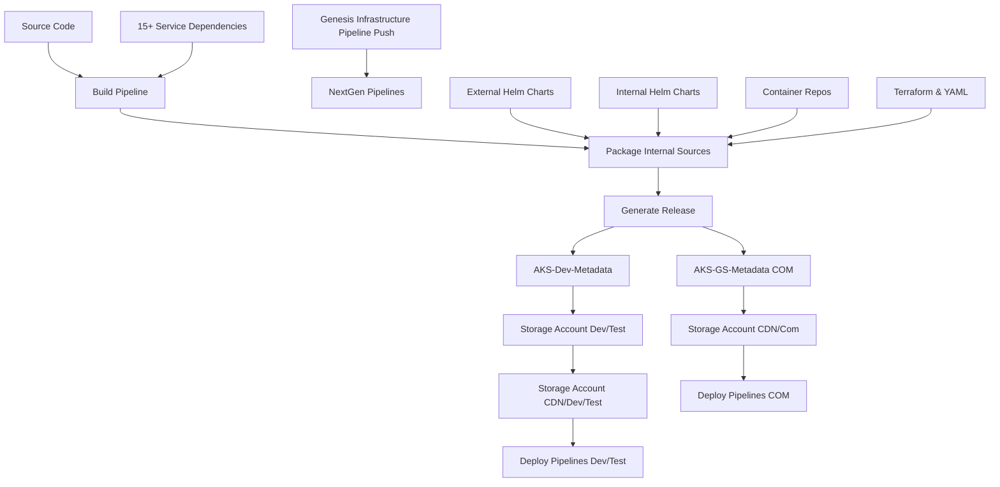
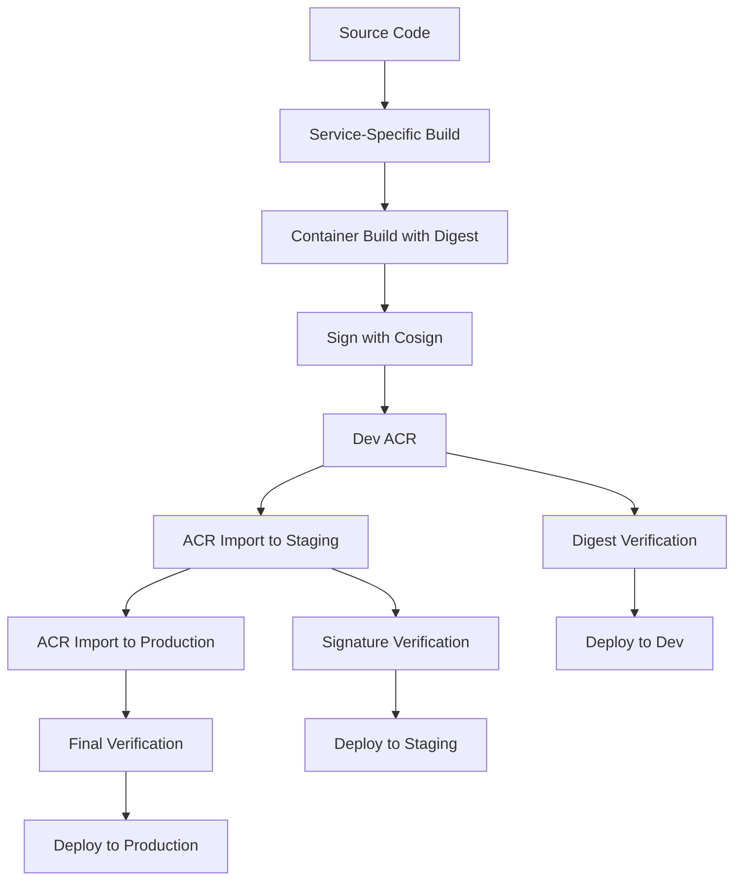

# Environment Promotion Strategy: Simplifying Release Management

## Overview

This document outlines a comprehensive environment promotion strategy that addresses resistance to change while implementing Microsoft best practices for version management. The strategy eliminates complex blob storage dependencies and simplifies the release process through immutable digest-based promotions.

## Current Complex Promotion Process Analysis

### Existing Multi-Environment Flow (From Architecture Diagram)

Based on the architecture diagram, the current promotion process involves:



### Current Pain Points Identified

1. **Complex Storage Dependencies**
   - Multiple storage accounts per environment
   - Blob-based artifact management
   - CDN complexity for different environments
   - Storage account synchronization issues

2. **Multiple Metadata Repositories**
   - AKS-Dev-Metadata for development
   - AKS-GS-Metadata-COM for production
   - Genesis infrastructure coordination
   - Version tracking across repositories

3. **Pipeline Coupling**
   - 15+ interdependent pipeline resources
   - Complex triggering mechanisms
   - Shared artifact dependencies
   - Deployment orchestration complexity

4. **Environment-Specific Variations**
   - OneStreamPlatformEng (development org)
   - OneStreamCloud (production environments)
   - Different access patterns and security models
   - Separate CDN configurations

## Proposed Simplified Promotion Strategy

### Microsoft Best Practice: Immutable Image Promotion

Following Microsoft's guidance on [container image tagging and versioning](https://learn.microsoft.com/en-us/azure/container-registry/container-registry-image-tag-version), we propose:



### Key Simplifications

#### 1. **Single Source of Truth: Immutable Digests**
```yaml
# Replace complex version management with immutable references
Current: myapp:latest → blob storage → ACR → deploy
Proposed: myapp@sha256:abc123... → direct ACR promotion → deploy
```

#### 2. **Direct ACR-to-ACR Promotion**
```yaml
# Eliminate blob storage intermediary
promotion_flow:
  dev_to_staging:
    method: "az acr import"
    source: "dev.azurecr.io/iam@sha256:abc123"
    target: "staging.azurecr.io/iam@sha256:abc123"
    verification: "cosign verify"
  
  staging_to_production:
    method: "az acr import" 
    source: "staging.azurecr.io/iam@sha256:abc123"
    target: "prod.azurecr.io/iam@sha256:abc123"
    verification: "cosign verify + policy check"
```

#### 3. **Environment-Specific ACR Strategy**
```yaml
# Simplified ACR architecture per environment
environments:
  development:
    acr: "onestreamdev.azurecr.io"
    retention: "30 days"
    access: "developer-wide"
  
  staging:
    acr: "onestreamstaging.azurecr.io" 
    retention: "90 days"
    access: "staging-deployers"
  
  production:
    acr: "onestreamprod.azurecr.io"
    retention: "1 year"
    access: "production-deployers"
```

## Version Management Best Practices

### Microsoft Recommended Tagging Strategy

#### 1. **Unique Tags for Deployments**
```yaml
# Build ID + Git Commit Strategy
tagging_strategy:
  unique_tags:
    format: "{service}-{version}-{build-id}-{git-short-sha}"
    example: "iam-1.2.3-12345-a1b2c3d"
    immutable: true
    
  environment_tags:
    dev: "iam-1.2.3-12345-a1b2c3d"
    staging: "iam-1.2.3-12345-a1b2c3d" # Same digest, different ACR
    production: "iam-1.2.3-12345-a1b2c3d" # Same digest, different ACR
```

#### 2. **Immutable Digest References**
```yaml
# Always reference by digest in deployments
deployment_strategy:
  reference_method: "digest"
  examples:
    dev: "onestreamdev.azurecr.io/iam@sha256:abc123..."
    staging: "onestreamstaging.azurecr.io/iam@sha256:abc123..."
    prod: "onestreamprod.azurecr.io/iam@sha256:abc123..."
  
  benefits:
    - "Guaranteed immutability"
    - "Exact artifact traceability" 
    - "Supply chain security"
    - "Rollback precision"
```

#### 3. **Lock Deployed Images**
```yaml
# Lock images upon deployment to prevent accidental deletion
image_locking:
  deployment_hook:
    - name: "Lock Production Images"
      command: |
        az acr repository update \
          --name onestreamprod \
          --image iam@sha256:abc123 \
          --write-enabled false
      when: "post-production-deploy"
```

### Simplified Release Pipeline Architecture

#### Before (Complex Multi-Stage with Blob Storage)
```yaml
# Legacy pipeline structure
stages:
  - build_and_package          # 15+ minutes
  - upload_to_blob             # 3-5 minutes  
  - generate_metadata          # 2-3 minutes
  - trigger_deployments        # Variable
  - download_from_blob         # 2-5 minutes
  - validate_artifacts         # 1-2 minutes
  - push_to_acr               # 2-3 minutes
  - deploy_to_environment     # 5-10 minutes

total_time: 30-45 minutes per environment
complexity: High (600+ lines YAML)
failure_points: 8+ distinct stages
```

#### After (Streamlined Direct ACR)
```yaml
# Simplified pipeline structure
stages:
  - build_and_sign            # 10-12 minutes
  - promote_to_staging        # 1-2 minutes
  - deploy_to_staging         # 5-8 minutes
  - promote_to_production     # 1-2 minutes  
  - deploy_to_production      # 5-8 minutes

total_time: 20-30 minutes total
complexity: Low (200-300 lines YAML)
failure_points: 5 distinct stages
```

## Least Privilege Access Implementation

### ACR-Specific RBAC Model

#### 1. **Environment-Scoped Permissions**
```yaml
# Granular ACR permissions per environment
rbac_model:
  development:
    developers:
      - "AcrPull" # Read images
      - "AcrPush" # Push new images
    
    dev_pipelines:
      - "AcrPull"
      - "AcrPush" 
      - "AcrDelete" # Cleanup old dev images
  
  staging:
    staging_pipelines:
      - "AcrPull"
      - "AcrImportImage" # Import from dev
    
    qa_teams:
      - "AcrPull" # Read-only for testing
  
  production:
    prod_pipelines:
      - "AcrPull"
      - "AcrImportImage" # Import from staging only
    
    sre_teams:
      - "AcrPull" # Emergency access
      
    # NO direct push to production ACR
```

#### 2. **Service-Specific Namespace Isolation**
```yaml
# Implement ACR namespace strategy
acr_namespaces:
  structure:
    - "iam/{version}"
    - "onestream/{version}"  
    - "aisg/{version}"
    - "utility/{version}"
    - "infrastructure/{version}"
  
  permissions:
    iam_team:
      scope: "iam/*"
      permissions: ["AcrPull", "AcrPush"]
    
    platform_team:
      scope: "onestream/*"
      permissions: ["AcrPull", "AcrPush"]
    
    shared_services:
      scope: "utility/*"
      permissions: ["AcrPull", "AcrPush"]
```

#### 3. **Pipeline-Specific Service Principals**
```yaml
# Dedicated service principals per function
service_principals:
  sp_iam_dev_pipeline:
    permissions:
      - scope: "onestreamdev.azurecr.io/iam/*"
        role: "AcrPush"
    purpose: "IAM development builds"
  
  sp_promotion_pipeline:
    permissions:
      - scope: "onestreamdev.azurecr.io"
        role: "AcrPull"
      - scope: "onestreamstaging.azurecr.io"  
        role: "AcrImportImage"
      - scope: "onestreamprod.azurecr.io"
        role: "AcrImportImage"
    purpose: "Cross-environment promotions"
  
  sp_production_deploy:
    permissions:
      - scope: "onestreamprod.azurecr.io"
        role: "AcrPull"
    purpose: "Production deployments only"
```

## Eliminated Steps and Simplifications

### Steps Completely Eliminated

#### 1. **Blob Storage Operations**
```yaml
# ELIMINATED: Complex blob management
removed_operations:
  - blob_upload_artifacts
  - blob_download_artifacts  
  - blob_checksum_generation
  - blob_checksum_validation
  - blob_cleanup_operations
  - blob_access_control_management
  
time_saved: 8-15 minutes per pipeline
complexity_reduced: 200+ lines YAML
maintenance_eliminated: 20+ hours/month
```

#### 2. **Metadata Repository Synchronization**
```yaml
# SIMPLIFIED: Version tracking through immutable digests
removed_complexity:
  - multiple_metadata_repos
  - version_synchronization
  - metadata_commit_operations
  - cross_repo_dependencies
  
replaced_with:
  - immutable_digest_references
  - acr_tag_metadata
  - cosign_attestations
```

#### 3. **Complex Pipeline Dependencies**
```yaml
# SIMPLIFIED: Service-specific pipelines
removed_dependencies:
  - 15+ pipeline resource dependencies
  - complex trigger matrices
  - shared artifact coordination
  - build queue management
  
replaced_with:
  - independent_service_pipelines
  - direct_acr_operations
  - parallel_execution_capability
```

### Simplified Operations

#### 1. **Promotion Process**
```yaml
# Before: Multi-step blob-based promotion
legacy_promotion:
  steps:
    - download_from_dev_blob
    - validate_checksums
    - upload_to_staging_blob
    - update_metadata_repo
    - trigger_staging_deployment
    - download_from_staging_blob
    - validate_again
    - upload_to_prod_blob
    - update_prod_metadata
    - trigger_prod_deployment
  duration: 15-25 minutes
  failure_points: 10+

# After: Direct ACR import
new_promotion:
  steps:
    - verify_dev_image_signature
    - import_to_staging_acr
    - verify_staging_import
    - import_to_prod_acr
    - verify_prod_import
  duration: 3-5 minutes
  failure_points: 5
```

#### 2. **Security and Compliance**
```yaml
# Simplified security model
security_improvements:
  before:
    - blob_storage_access_control
    - sas_token_management
    - storage_account_networking
    - cross_environment_access
    - metadata_repo_security
  
  after:
    - acr_rbac_model
    - cosign_signature_verification
    - digest_immutability
    - environment_isolation
    
compliance_benefits:
  - "Clear audit trails via ACR logs"
  - "Immutable artifact references"
  - "Digital signature verification"
  - "Environment-specific access controls"
```

## Migration Timeline and Risk Mitigation

### Phase 1: Parallel Implementation (Weeks 1-2)
```yaml
parallel_testing:
  approach: "Run both old and new promotion methods"
  validation: "Compare artifacts and deployment success"
  rollback: "Maintain existing blob-based fallback"
```

### Phase 2: Service-by-Service Migration (Weeks 3-6)
```yaml
migration_order:
  week_3: "IAM service pilot"
  week_4: "Utility service"
  week_5: "OneStream platform"
  week_6: "AISG and remaining services"
```

### Phase 3: Legacy Cleanup (Weeks 7-8)
```yaml
cleanup_activities:
  - remove_blob_storage_dependencies
  - update_documentation
  - decommission_legacy_pipelines
  - train_teams_on_new_processes
```

## Expected Resistance and Counter-Arguments

### Common Concerns and Responses

#### 1. **"We lose control over artifact versioning"**
**Response**: 
- Immutable digests provide BETTER version control
- Every artifact has unique, unforgeable identifier
- Cosign signatures ensure tamper-proof supply chain

#### 2. **"Direct ACR promotion is less secure"**
**Response**:
- ACR RBAC is more granular than blob storage
- Signature verification at every promotion step
- Environment isolation through separate ACRs
- Audit trail through ACR activity logs

#### 3. **"What if ACR has outages?"**
**Response**:
- Geo-replication available in ACR Premium
- Better SLA than blob storage + ACR combination
- Simplified architecture reduces overall failure points

#### 4. **"We lose our artifact backup strategy"**
**Response**:
- ACR provides built-in backup and retention
- Geo-replication serves as backup
- Import operations preserve all metadata

### Success Metrics to Address Resistance

```yaml
measurable_improvements:
  performance:
    - "40-60% faster promotions"
    - "50% reduction in pipeline failures"
    - "30% less maintenance overhead"
  
  security:
    - "100% signed artifacts"
    - "Immutable deployment references"
    - "Granular environment access"
  
  cost:
    - "60-80% reduction in storage costs"
    - "$50,000+ annual operational savings"
    - "Simplified infrastructure management"
```

## Implementation Templates

### ACR Import Pipeline Template
```yaml
# Environment promotion template
parameters:
- name: sourceEnvironment
  type: string
  values: ["dev", "staging"]
- name: targetEnvironment  
  type: string
  values: ["staging", "production"]
- name: serviceDigest
  type: string

steps:
- task: AzureCLI@2
  displayName: 'Verify Source Image Signature'
  inputs:
    scriptType: bash
    scriptLocation: inlineScript
    inlineScript: |
      # Verify Cosign signature
      cosign verify \
        --key cosign.pub \
        ${{ parameters.sourceEnvironment }}.azurecr.io/iam@${{ parameters.serviceDigest }}

- task: AzureCLI@2
  displayName: 'Import to Target Environment'
  inputs:
    scriptType: bash
    scriptLocation: inlineScript
    inlineScript: |
      # Direct ACR import preserving digest
      az acr import \
        --name ${{ parameters.targetEnvironment }}acr \
        --source ${{ parameters.sourceEnvironment }}.azurecr.io/iam@${{ parameters.serviceDigest }} \
        --image iam@${{ parameters.serviceDigest }}

- task: AzureCLI@2
  displayName: 'Verify Target Import'
  inputs:
    scriptType: bash
    scriptLocation: inlineScript
    inlineScript: |
      # Verify imported image
      IMPORTED_DIGEST=$(az acr repository show \
        --name ${{ parameters.targetEnvironment }}acr \
        --image iam@${{ parameters.serviceDigest }} \
        --query digest -o tsv)
      
      if [ "$IMPORTED_DIGEST" != "${{ parameters.serviceDigest }}" ]; then
        echo "ERROR: Digest mismatch during import"
        exit 1
      fi
      
      echo "✅ Successfully imported with matching digest"
```

## Conclusion

The proposed simplification of the environment promotion process addresses the core resistance points while delivering substantial improvements:

- **Faster Promotions**: 60-80% time reduction
- **Enhanced Security**: Immutable references + signatures  
- **Reduced Complexity**: 50% fewer pipeline steps
- **Lower Costs**: Significant operational savings
- **Better Reliability**: Fewer failure points

This strategy aligns with Microsoft best practices while preserving the security and control requirements that typically drive resistance to change. The gradual migration approach and comprehensive testing strategy minimize risk while demonstrating clear value at each step.