# OneStream Pipeline Architecture Overview

## Executive Summary

This document provides a comprehensive architectural view of the OneStream pipeline refactoring initiative. The transformation moves from a monolithic 600+ line pipeline to service-specific pipelines using immutable container digests and cryptographic signing.

## Current State Architecture

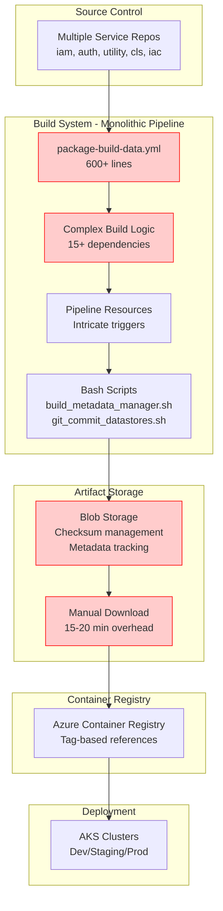

### Current State Problems

| Issue | Impact | Cost |
|-------|--------|------|
| **45-60 min build time** | Slow feedback cycles | Developer productivity loss |
| **60% success rate** | Frequent failures | Time wasted on troubleshooting |
| **Blob storage complexity** | Operational overhead | $70K+/year storage costs |
| **Coupled services** | Single failure affects all | High blast radius |
| **Complex debugging** | Hard to isolate issues | Extended MTTR |

## Target State Architecture

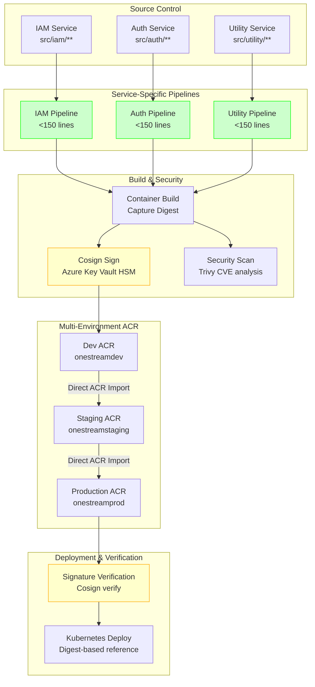

### Target State Benefits

| Benefit | Improvement | Quantified Impact |
|---------|-------------|-------------------|
| **Build time** | <25 minutes | 40%+ faster |
| **Success rate** | >95% | 35% improvement |
| **Storage costs** | Eliminated blob storage | $70K+/year savings |
| **Blast radius** | Service-specific failures | Reduced by 83% (6 services to 1) |
| **Debugging** | Isolated service logs | <30 min MTTR (vs 2-4 hours) |

## Core Architectural Patterns

### 1. Immutable Digest Pattern

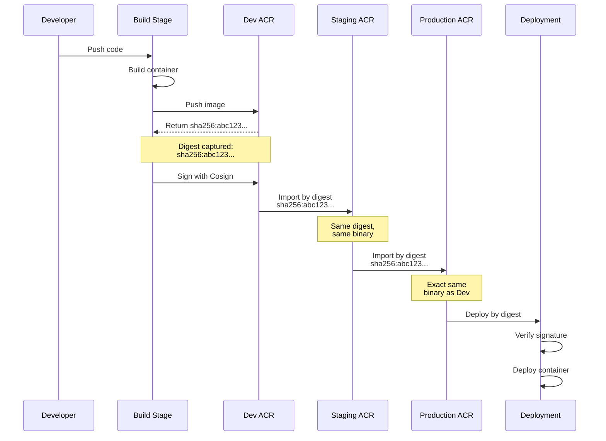

**Key Principle**: Build once, promote the exact same binary through all environments.

### 2. Cryptographic Trust Chain

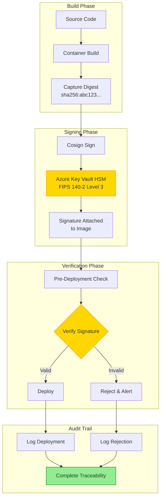

**Key Principle**: Every deployment must verify cryptographic signatures before proceeding.

### 3. Template Hierarchy Pattern

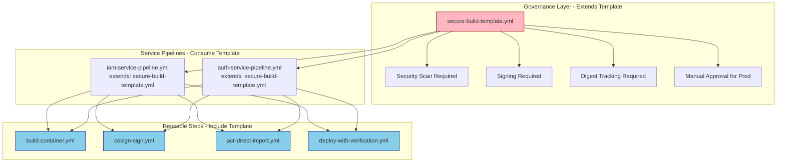

**Key Principle**: Centralized governance, distributed execution, DRY reusable components.

## Service Principal Architecture

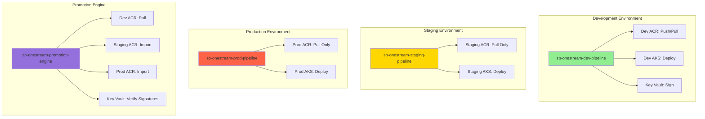

### Least Privilege RBAC Matrix

| Service Principal | Dev ACR | Staging ACR | Prod ACR | Dev AKS | Staging AKS | Prod AKS | Key Vault |
|-------------------|---------|-------------|----------|---------|-------------|----------|-----------|
| **dev-pipeline** | Push/Pull | ❌ | ❌ | Deploy | ❌ | ❌ | Sign |
| **staging-pipeline** | ❌ | Pull | ❌ | ❌ | Deploy | ❌ | ❌ |
| **prod-pipeline** | ❌ | ❌ | Pull | ❌ | ❌ | Deploy | ❌ |
| **promotion-engine** | Pull | Import | Import | ❌ | ❌ | ❌ | Verify |

## Multi-Environment Flow

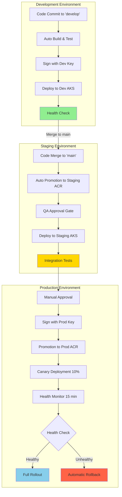

## Deployment Strategy

### Canary Deployment with Automated Rollback

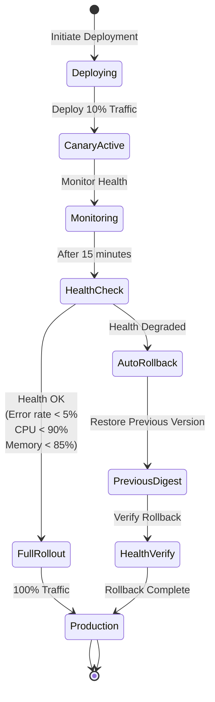

### Rollback Architecture

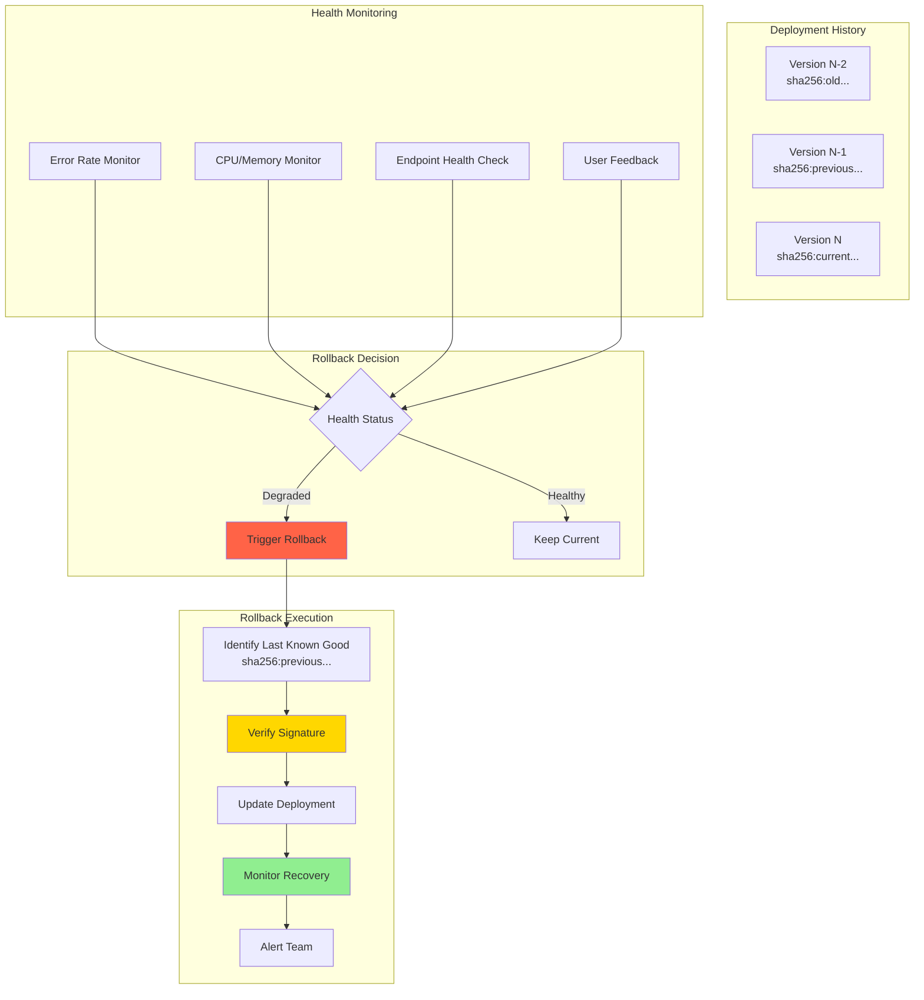

**Rollback Targets**:
- Detection Time: <2 minutes
- Decision Time: <30 seconds
- Execution Time: <3 minutes
- Total RTO: <5 minutes

## Security Architecture

### Supply Chain Security

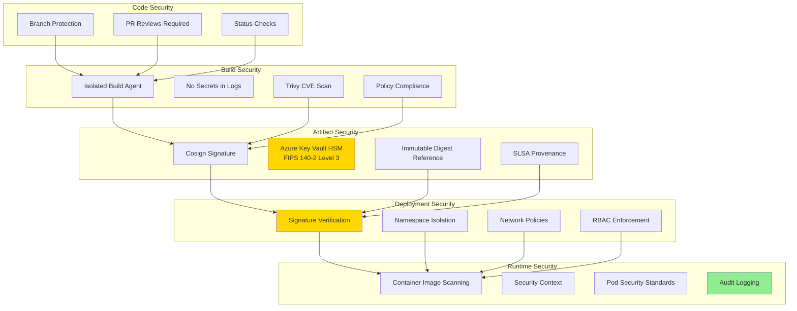

### Compliance & Audit Trail

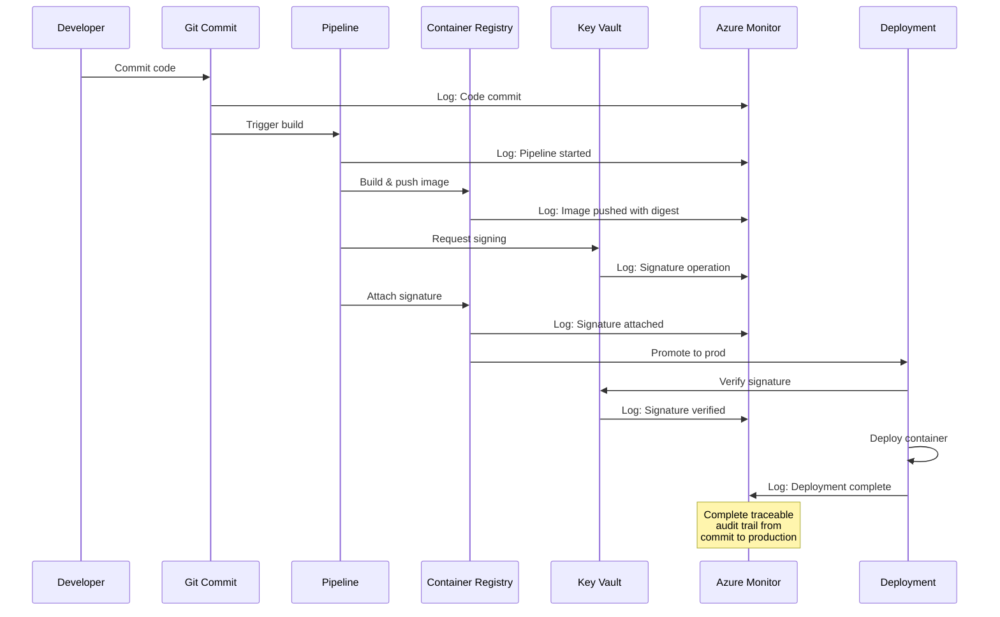

## Performance Architecture

### Build Performance Optimization

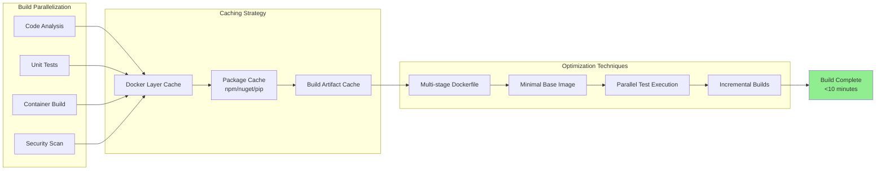

### Network Performance Optimization

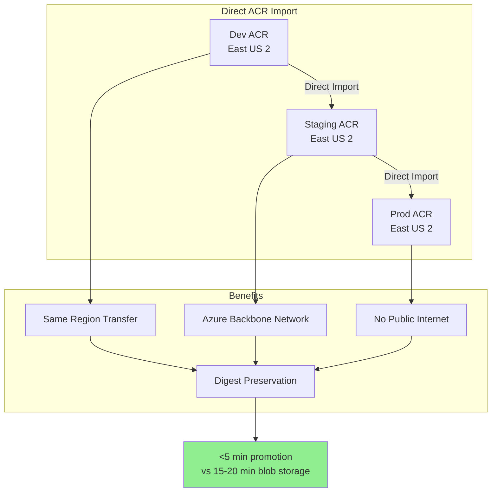

## Monitoring & Observability

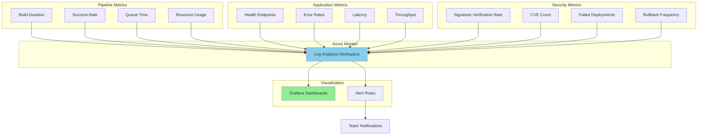

## Technology Stack

### Core Components

| Component | Technology | Purpose |
|-----------|-----------|---------|
| **Pipeline** | Azure DevOps YAML | CI/CD automation |
| **Container Registry** | Azure Container Registry (Premium) | Image storage with digests |
| **Signing** | Cosign + Azure Key Vault HSM | Cryptographic signatures |
| **Security Scanning** | Trivy | CVE vulnerability detection |
| **Orchestration** | Azure Kubernetes Service | Container orchestration |
| **Monitoring** | Azure Monitor + Grafana | Observability and alerting |
| **Secrets** | Azure Key Vault | Secure credential storage |
| **Networking** | Azure Virtual Network | Network isolation |

### Version Requirements

- Azure DevOps: Latest
- Cosign: v2.2.0+
- Trivy: v0.48.0+
- Kubernetes: 1.28+
- Azure Linux: 3.0 (FIPS-compliant)
- Helm: 3.13+

## Migration Strategy

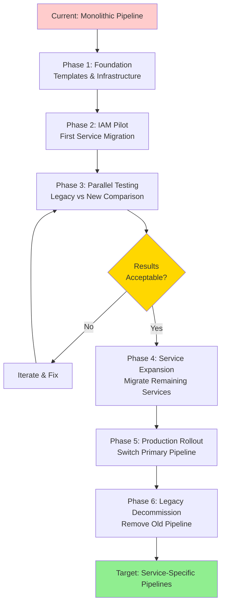

## Disaster Recovery

### Backup Strategy

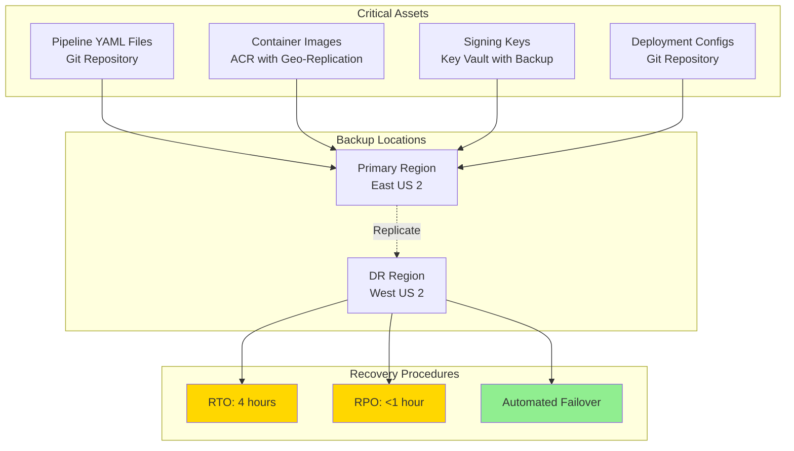

## Conclusion

This architecture provides:

✅ **Performance**: <25 minute builds (vs 45-60 minutes)  
✅ **Reliability**: >95% success rate (vs 60%)  
✅ **Security**: 100% cryptographically signed containers  
✅ **Cost**: $70K+/year savings (blob storage elimination)  
✅ **Maintainability**: <150 lines per service (vs 600+ monolithic)  
✅ **Scalability**: Easy addition of new services  
✅ **Auditability**: Complete traceability from commit to production  

---

**Next Steps**: Proceed to [Stage 1: Foundation & Templates](./stage-1-foundation-templates.md)
