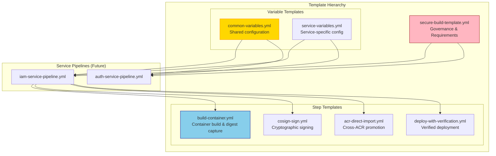

# Stage 1: Foundation & Templates

**Duration**: 7 days  
**Effort**: 1 engineer  
**Dependencies**: None (foundation work)

## Objectives

- Establish reusable pipeline template structure
- Create variable management framework
- Set up Azure DevOps project infrastructure
- Build core pipeline components
- Enable consistent, maintainable pipelines across all services

## Success Criteria

- [ ] Template directory structure created and documented
- [ ] Common variables template validated
- [ ] Core step templates (build, sign, import, deploy) tested independently
- [ ] Secure build template with governance enforced
- [ ] Documentation complete with usage examples

## Architecture Overview



## Tasks Breakdown

### Task 1.1: Create Template Directory Structure (Day 1, 2 hours)

**Objective**: Establish organized template hierarchy

#### Implementation Steps

1. **Create directory structure**:
```bash
cd /Users/john/Documents/OneStream/Refactor-Build
mkdir -p templates/variables
mkdir -p templates/steps
mkdir -p templates/secure
```

2. **Create .gitkeep files** (if using Git):
```bash
touch templates/variables/.gitkeep
touch templates/steps/.gitkeep
touch templates/secure/.gitkeep
```

3. **Document structure** in `templates/README.md`:

```markdown
# Pipeline Templates

## Directory Structure

```
templates/
├── secure/
│   └── secure-build-template.yml      # Governance template (extends)
├── variables/
│   ├── common-variables.yml            # Shared configuration
│   └── <service>-variables.yml         # Service-specific config
└── steps/
    ├── build-container.yml             # Container build
    ├── cosign-sign.yml                 # Signing
    ├── acr-direct-import.yml           # ACR promotion
    └── deploy-with-verification.yml    # Deployment
```

## Usage Patterns

### Extends (Governance)
Service pipelines must extend the secure build template to enforce requirements:

```yaml
extends:
  template: templates/secure/secure-build-template.yml
  parameters:
    serviceName: 'myservice'
```

### Include (Reusable Steps)
Templates can include step templates for DRY principles:

```yaml
steps:
- template: templates/steps/build-container.yml
  parameters:
    serviceName: $(serviceName)
```
```

#### Validation

- [ ] Directory structure exists
- [ ] README.md documents usage patterns
- [ ] Team can access template location

---

### Task 1.2: Create Common Variables Template (Day 1, 3 hours)

**Objective**: Define shared configuration used across all services

#### Implementation

Create `templates/variables/common-variables.yml`:

```yaml
# templates/variables/common-variables.yml
# Common variables shared across all OneStream service pipelines
# Version: 1.0.0

variables:
  # ============================================================================
  # Azure DevOps Configuration
  # ============================================================================
  
  # System configuration
  system.debug: false
  
  # ============================================================================
  # Azure Container Registry (ACR) Configuration
  # ============================================================================
  
  # Development environment
  containerRegistryDev: 'onestreamdev.azurecr.io'
  containerRegistryDevName: 'onestreamdev'
  
  # Staging environment
  containerRegistryStaging: 'onestreamstaging.azurecr.io'
  containerRegistryStagingName: 'onestreamstaging'
  
  # Production environment
  containerRegistryProd: 'onestreamprod.azurecr.io'
  containerRegistryProdName: 'onestreamprod'
  
  # ============================================================================
  # Azure Service Connections
  # ============================================================================
  
  # Development service principal
  serviceConnectionDev: 'sc-onestream-poc-dev'
  
  # Staging service principal
  serviceConnectionStaging: 'sc-onestream-poc-staging'
  
  # Production service principal
  serviceConnectionProd: 'sc-onestream-poc-prod'
  
  # Promotion engine service principal
  serviceConnectionPromotion: 'sc-onestream-poc-promotion'
  
  # ============================================================================
  # Azure Key Vault Configuration
  # ============================================================================
  
  # Key Vault for Cosign signing keys
  keyVaultName: 'onestream-poc-cosign-kv'
  keyVaultUrl: 'https://onestream-poc-cosign-kv.vault.azure.net/'
  
  # Signing key names
  signingKeyDev: 'cosign-dev-signing-key'
  signingKeyStaging: 'cosign-staging-signing-key'
  signingKeyProd: 'cosign-prod-signing-key'
  
  # ============================================================================
  # Azure Kubernetes Service (AKS) Configuration
  # ============================================================================
  
  # Development cluster
  aksClusterDev: 'onestream-poc-dev-aks'
  aksResourceGroupDev: 'onestream-poc-dev-rg'
  
  # Staging cluster
  aksClusterStaging: 'onestream-poc-staging-aks'
  aksResourceGroupStaging: 'onestream-poc-staging-rg'
  
  # Production cluster
  aksClusterProd: 'onestream-poc-prod-aks'
  aksResourceGroupProd: 'onestream-poc-prod-rg'
  
  # ============================================================================
  # Build Configuration
  # ============================================================================
  
  # Docker configuration
  dockerfilePath: 'Dockerfile'
  dockerBuildContext: '.'
  
  # Build caching
  buildCacheEnabled: true
  
  # ============================================================================
  # Security Configuration
  # ============================================================================
  
  # Trivy vulnerability scanning
  trivyScanEnabled: true
  trivySeverity: 'CRITICAL,HIGH'
  trivyExitCode: '1'  # Fail build on vulnerabilities
  
  # Cosign signing
  cosignVersion: '2.2.0'
  signatureRequired: true
  
  # ============================================================================
  # Deployment Configuration
  # ============================================================================
  
  # Helm configuration
  helmVersion: '3.13.0'
  helmChartPath: 'charts'
  
  # Health check configuration
  healthCheckTimeout: 300  # 5 minutes
  healthCheckRetries: 10
  healthCheckDelay: 30  # 30 seconds between retries
  
  # Canary deployment configuration
  canaryPercentage: 10
  canaryDuration: 900  # 15 minutes
  
  # ============================================================================
  # Monitoring & Logging
  # ============================================================================
  
  # Azure Monitor
  logAnalyticsWorkspace: 'onestream-poc-logs'
  
  # ============================================================================
  # Version Management
  # ============================================================================
  
  # Version format: poc-{buildId}-{gitSha}
  versionPrefix: 'poc'
  
  # ============================================================================
  # Timeout Configuration
  # ============================================================================
  
  # Job timeouts (in minutes)
  jobTimeoutBuild: 20
  jobTimeoutDeploy: 15
  jobTimeoutTest: 30
```

#### Usage Example

In a service pipeline:

```yaml
# iam-service-pipeline.yml
trigger:
  branches:
    include:
    - develop
    - main

variables:
- template: templates/variables/common-variables.yml
- template: templates/variables/iam-variables.yml

stages:
- stage: Build
  jobs:
  - job: BuildContainer
    timeoutInMinutes: $(jobTimeoutBuild)
    steps:
    - script: |
        echo "Using registry: $(containerRegistryDev)"
        echo "Service connection: $(serviceConnectionDev)"
      displayName: 'Display configuration'
```

#### Validation

- [ ] YAML syntax valid (`yamllint common-variables.yml`)
- [ ] All ACR names match actual Azure resources
- [ ] Service connection names match Azure DevOps configuration
- [ ] Key Vault URL is correct
- [ ] AKS cluster names verified

---

### Task 1.3: Create Build Container Step Template (Day 2, 4 hours)

**Objective**: Reusable container build with digest capture

#### Implementation

Create `templates/steps/build-container.yml`:

```yaml
# templates/steps/build-container.yml
# Builds container image and captures immutable digest
# Version: 1.0.0

parameters:
- name: serviceName
  type: string
  displayName: 'Name of the service being built'

- name: containerRegistry
  type: string
  displayName: 'Container registry URL'

- name: containerRegistryName
  type: string
  displayName: 'Container registry name (for Azure CLI)'

- name: serviceConnection
  type: string
  displayName: 'Azure service connection'

- name: dockerfilePath
  type: string
  default: 'Dockerfile'
  displayName: 'Path to Dockerfile'

- name: buildContext
  type: string
  default: '.'
  displayName: 'Docker build context'

- name: buildArgs
  type: string
  default: ''
  displayName: 'Docker build arguments'

- name: enableCache
  type: boolean
  default: true
  displayName: 'Enable Docker layer caching'

steps:
- task: AzureCLI@2
  name: buildContainer
  displayName: 'Build container and capture digest'
  inputs:
    azureSubscription: ${{ parameters.serviceConnection }}
    scriptType: 'bash'
    scriptLocation: 'inlineScript'
    inlineScript: |
      set -euo pipefail
      
      echo "=========================================="
      echo "Building container for: ${{ parameters.serviceName }}"
      echo "=========================================="
      
      # Generate version metadata
      BUILD_ID="$(Build.BuildId)"
      GIT_SHA=$(echo $(Build.SourceVersion) | cut -c1-7)
      POC_VERSION="poc-${BUILD_ID}-${GIT_SHA}"
      TIMESTAMP=$(date -u +"%Y-%m-%dT%H:%M:%SZ")
      
      echo "POC Version: ${POC_VERSION}"
      echo "Git SHA: ${GIT_SHA}"
      echo "Build ID: ${BUILD_ID}"
      echo "Timestamp: ${TIMESTAMP}"
      
      # Construct image reference with tag
      IMAGE_TAG="${{ parameters.serviceName }}:${BUILD_ID}"
      IMAGE_FULL="${{ parameters.containerRegistry }}/${IMAGE_TAG}"
      
      echo "Building image: ${IMAGE_FULL}"
      
      # Prepare build arguments
      BUILD_ARGS_ARRAY=()
      if [ -n "${{ parameters.buildArgs }}" ]; then
        BUILD_ARGS_ARRAY=(--build-arg "${{ parameters.buildArgs }}")
      fi
      
      # Add metadata labels
      BUILD_ARGS_ARRAY+=(
        --build-arg "BUILD_ID=${BUILD_ID}"
        --build-arg "GIT_SHA=${GIT_SHA}"
        --build-arg "POC_VERSION=${POC_VERSION}"
        --build-arg "BUILD_TIMESTAMP=${TIMESTAMP}"
      )
      
      # Build container with ACR
      echo "Starting ACR build..."
      az acr build \
        --registry ${{ parameters.containerRegistryName }} \
        --image "${IMAGE_TAG}" \
        --file ${{ parameters.dockerfilePath }} \
        "${BUILD_ARGS_ARRAY[@]}" \
        ${{ parameters.buildContext }}
      
      if [ $? -ne 0 ]; then
        echo "##vso[task.logissue type=error]Container build failed"
        exit 1
      fi
      
      echo "Build completed successfully"
      
      # Capture immutable digest
      echo "Retrieving image digest..."
      DIGEST=$(az acr repository show \
        --name ${{ parameters.containerRegistryName }} \
        --image "${IMAGE_TAG}" \
        --query "digest" \
        --output tsv)
      
      if [ -z "$DIGEST" ]; then
        echo "##vso[task.logissue type=error]Failed to capture digest"
        exit 1
      fi
      
      echo "=========================================="
      echo "✅ Build Complete"
      echo "=========================================="
      echo "Image Tag: ${IMAGE_TAG}"
      echo "Digest: ${DIGEST}"
      echo "POC Version: ${POC_VERSION}"
      echo "=========================================="
      
      # Export digest as output variable for downstream stages
      echo "##vso[task.setvariable;variable=IMAGE_DIGEST;isOutput=true]${DIGEST}"
      echo "##vso[task.setvariable;variable=POC_VERSION;isOutput=true]${POC_VERSION}"
      echo "##vso[task.setvariable;variable=IMAGE_TAG;isOutput=true]${IMAGE_TAG}"
      
      # Create digest reference (registry/service@sha256:...)
      DIGEST_REF="${{ parameters.containerRegistry }}/${{ parameters.serviceName }}@${DIGEST}"
      echo "##vso[task.setvariable;variable=DIGEST_REF;isOutput=true]${DIGEST_REF}"
      
      echo "Digest reference: ${DIGEST_REF}"

- task: PublishPipelineArtifact@1
  displayName: 'Publish build metadata'
  inputs:
    targetPath: '$(Build.ArtifactStagingDirectory)'
    artifact: 'build-metadata-${{ parameters.serviceName }}'
    publishLocation: 'pipeline'
  condition: succeededOrFailed()
```

#### Usage Example

```yaml
# In a service pipeline
stages:
- stage: Build
  jobs:
  - job: BuildContainer
    steps:
    - template: templates/steps/build-container.yml
      parameters:
        serviceName: 'iam'
        containerRegistry: $(containerRegistryDev)
        containerRegistryName: $(containerRegistryDevName)
        serviceConnection: $(serviceConnectionDev)
        dockerfilePath: 'src/iam/Dockerfile'
        buildContext: 'src/iam'
        buildArgs: 'NODE_ENV=production'

- stage: Deploy
  dependsOn: Build
  variables:
    # Access digest from build stage
    imageDigest: $[ stageDependencies.Build.BuildContainer.outputs['buildContainer.IMAGE_DIGEST'] ]
  jobs:
  - job: DeployDev
    steps:
    - script: |
        echo "Deploying digest: $(imageDigest)"
```

#### Validation

- [ ] YAML syntax valid
- [ ] Parameters properly typed
- [ ] Digest captured as output variable
- [ ] Error handling in place
- [ ] Metadata labels included
- [ ] Test with actual ACR build

---

### Task 1.4: Create Cosign Signing Step Template (Day 2-3, 4 hours)

**Objective**: Reusable cryptographic signing with Azure Key Vault

#### Implementation

Create `templates/steps/cosign-sign.yml`:

```yaml
# templates/steps/cosign-sign.yml
# Signs container image using Cosign and Azure Key Vault HSM
# Version: 1.0.0

parameters:
- name: serviceName
  type: string
  displayName: 'Name of the service'

- name: digestReference
  type: string
  displayName: 'Full digest reference (registry/service@sha256:...)'

- name: serviceConnection
  type: string
  displayName: 'Azure service connection'

- name: keyVaultName
  type: string
  displayName: 'Azure Key Vault name'

- name: signingKeyName
  type: string
  displayName: 'Signing key name in Key Vault'

- name: cosignVersion
  type: string
  default: '2.2.0'
  displayName: 'Cosign version'

steps:
- task: AzureCLI@2
  name: installCosign
  displayName: 'Install Cosign'
  inputs:
    azureSubscription: ${{ parameters.serviceConnection }}
    scriptType: 'bash'
    scriptLocation: 'inlineScript'
    inlineScript: |
      set -euo pipefail
      
      echo "Installing Cosign v${{ parameters.cosignVersion }}..."
      
      # Download Cosign binary
      COSIGN_VERSION="${{ parameters.cosignVersion }}"
      COSIGN_URL="https://github.com/sigstore/cosign/releases/download/v${COSIGN_VERSION}/cosign-linux-amd64"
      
      curl -sSL "${COSIGN_URL}" -o /tmp/cosign
      chmod +x /tmp/cosign
      
      # Verify installation
      /tmp/cosign version
      
      echo "✅ Cosign installed successfully"

- task: AzureCLI@2
  name: signImage
  displayName: 'Sign container image'
  inputs:
    azureSubscription: ${{ parameters.serviceConnection }}
    scriptType: 'bash'
    scriptLocation: 'inlineScript'
    addSpnToEnvironment: true
    inlineScript: |
      set -euo pipefail
      
      echo "=========================================="
      echo "Signing Image"
      echo "=========================================="
      echo "Service: ${{ parameters.serviceName }}"
      echo "Digest Reference: ${{ parameters.digestReference }}"
      echo "Key Vault: ${{ parameters.keyVaultName }}"
      echo "Signing Key: ${{ parameters.signingKeyName }}"
      echo "=========================================="
      
      # Construct Azure Key Vault key reference
      KEY_ID="azurekms://${{ parameters.keyVaultName }}.vault.azure.net/${{ parameters.signingKeyName }}"
      
      echo "Key ID: ${KEY_ID}"
      
      # Authenticate to ACR using service principal
      echo "Authenticating to ACR..."
      ACR_NAME=$(echo "${{ parameters.digestReference }}" | cut -d'.' -f1 | cut -d'/' -f1)
      
      az acr login --name "${ACR_NAME}"
      
      # Set Azure credentials for Cosign
      export AZURE_CLIENT_ID="${servicePrincipalId}"
      export AZURE_CLIENT_SECRET="${servicePrincipalKey}"
      export AZURE_TENANT_ID="${tenantId}"
      
      # Sign the image
      echo "Signing image with Cosign..."
      /tmp/cosign sign \
        --key "${KEY_ID}" \
        --yes \
        "${{ parameters.digestReference }}"
      
      if [ $? -ne 0 ]; then
        echo "##vso[task.logissue type=error]Image signing failed"
        exit 1
      fi
      
      echo "=========================================="
      echo "✅ Image Signed Successfully"
      echo "=========================================="
      
      # Verify signature (validation)
      echo "Verifying signature..."
      /tmp/cosign verify \
        --key "${KEY_ID}" \
        "${{ parameters.digestReference }}" || true
      
      echo "Signature verification check completed"
      
      # Export signing confirmation
      echo "##vso[task.setvariable;variable=SIGNATURE_CONFIRMED;isOutput=true]true"

- task: AzureCLI@2
  name: inspectSignature
  displayName: 'Inspect signature metadata'
  inputs:
    azureSubscription: ${{ parameters.serviceConnection }}
    scriptType: 'bash'
    scriptLocation: 'inlineScript'
    inlineScript: |
      set -euo pipefail
      
      echo "Inspecting signature tree..."
      /tmp/cosign tree "${{ parameters.digestReference }}" || echo "Tree inspection completed"
```

#### Usage Example

```yaml
# In a service pipeline
stages:
- stage: Sign
  dependsOn: Build
  variables:
    digestRef: $[ stageDependencies.Build.BuildContainer.outputs['buildContainer.DIGEST_REF'] ]
  jobs:
  - job: SignImage
    steps:
    - template: templates/steps/cosign-sign.yml
      parameters:
        serviceName: 'iam'
        digestReference: $(digestRef)
        serviceConnection: $(serviceConnectionDev)
        keyVaultName: $(keyVaultName)
        signingKeyName: $(signingKeyDev)
```

#### Security Notes

- Uses Azure Key Vault HSM (FIPS 140-2 Level 3)
- Service principal credentials automatically injected
- Signature attached to image digest in ACR
- Verification step validates signing process

#### Validation

- [ ] Cosign installation successful
- [ ] Azure Key Vault authentication works
- [ ] Signature attached to image
- [ ] Verification confirms signature validity
- [ ] Error handling in place

---

### Task 1.5: Create ACR Direct Import Step Template (Day 3, 3 hours)

**Objective**: Cross-ACR image promotion preserving digests

#### Implementation

Create `templates/steps/acr-direct-import.yml`:

```yaml
# templates/steps/acr-direct-import.yml
# Promotes container image between ACRs using direct import
# Preserves immutable digest reference
# Version: 1.0.0

parameters:
- name: serviceName
  type: string
  displayName: 'Name of the service'

- name: sourceRegistry
  type: string
  displayName: 'Source ACR (e.g., onestreamdev.azurecr.io)'

- name: targetRegistry
  type: string
  displayName: 'Target ACR (e.g., onestreamstaging.azurecr.io)'

- name: targetRegistryName
  type: string
  displayName: 'Target ACR name (for Azure CLI)'

- name: digestReference
  type: string
  displayName: 'Source digest reference (registry/service@sha256:...)'

- name: serviceConnection
  type: string
  displayName: 'Azure service connection with import permissions'

steps:
- task: AzureCLI@2
  name: importImage
  displayName: 'Import image to target ACR'
  inputs:
    azureSubscription: ${{ parameters.serviceConnection }}
    scriptType: 'bash'
    scriptLocation: 'inlineScript'
    inlineScript: |
      set -euo pipefail
      
      echo "=========================================="
      echo "ACR Direct Import"
      echo "=========================================="
      echo "Service: ${{ parameters.serviceName }}"
      echo "Source: ${{ parameters.digestReference }}"
      echo "Target ACR: ${{ parameters.targetRegistry }}"
      echo "=========================================="
      
      # Extract digest from reference
      DIGEST=$(echo "${{ parameters.digestReference }}" | grep -oP 'sha256:[a-f0-9]+')
      
      if [ -z "$DIGEST" ]; then
        echo "##vso[task.logissue type=error]Failed to extract digest from reference"
        exit 1
      fi
      
      echo "Digest: ${DIGEST}"
      
      # Import image using digest
      echo "Starting import..."
      az acr import \
        --name ${{ parameters.targetRegistryName }} \
        --source "${{ parameters.digestReference }}" \
        --image "${{ parameters.serviceName }}@${DIGEST}" \
        --force
      
      if [ $? -ne 0 ]; then
        echo "##vso[task.logissue type=error]ACR import failed"
        exit 1
      fi
      
      echo "Import completed successfully"
      
      # Verify digest preservation
      echo "Verifying digest preservation..."
      TARGET_DIGEST=$(az acr repository show \
        --name ${{ parameters.targetRegistryName }} \
        --image "${{ parameters.serviceName }}@${DIGEST}" \
        --query "digest" \
        --output tsv)
      
      if [ "$TARGET_DIGEST" != "$DIGEST" ]; then
        echo "##vso[task.logissue type=error]Digest mismatch! Expected: ${DIGEST}, Got: ${TARGET_DIGEST}"
        exit 1
      fi
      
      echo "✅ Digest verified: ${TARGET_DIGEST}"
      
      # Construct target digest reference
      TARGET_DIGEST_REF="${{ parameters.targetRegistry }}/${{ parameters.serviceName }}@${DIGEST}"
      
      echo "=========================================="
      echo "✅ Import Complete"
      echo "=========================================="
      echo "Target Digest Reference: ${TARGET_DIGEST_REF}"
      echo "=========================================="
      
      # Export target digest reference
      echo "##vso[task.setvariable;variable=TARGET_DIGEST_REF;isOutput=true]${TARGET_DIGEST_REF}"
      echo "##vso[task.setvariable;variable=IMPORT_VERIFIED;isOutput=true]true"
```

#### Usage Example

```yaml
# In a promotion pipeline
stages:
- stage: PromoteToStaging
  dependsOn: Build
  variables:
    sourceDigestRef: $[ stageDependencies.Build.BuildContainer.outputs['buildContainer.DIGEST_REF'] ]
  jobs:
  - job: ImportToStaging
    steps:
    - template: templates/steps/acr-direct-import.yml
      parameters:
        serviceName: 'iam'
        sourceRegistry: $(containerRegistryDev)
        targetRegistry: $(containerRegistryStaging)
        targetRegistryName: $(containerRegistryStagingName)
        digestReference: $(sourceDigestRef)
        serviceConnection: $(serviceConnectionPromotion)
```

#### Validation

- [ ] Import preserves exact digest
- [ ] Verification step confirms digest match
- [ ] Target digest reference exported
- [ ] Error handling for import failures
- [ ] Works across subscriptions (if applicable)

---

### Task 1.6: Create Deployment with Verification Step Template (Day 4, 4 hours)

**Objective**: Deploy container with signature verification

#### Implementation

Create `templates/steps/deploy-with-verification.yml`:

```yaml
# templates/steps/deploy-with-verification.yml
# Deploys container to AKS with signature verification
# Version: 1.0.0

parameters:
- name: serviceName
  type: string
  displayName: 'Name of the service'

- name: digestReference
  type: string
  displayName: 'Digest reference to deploy'

- name: aksCluster
  type: string
  displayName: 'AKS cluster name'

- name: aksResourceGroup
  type: string
  displayName: 'AKS resource group'

- name: namespace
  type: string
  displayName: 'Kubernetes namespace'

- name: serviceConnection
  type: string
  displayName: 'Azure service connection'

- name: keyVaultName
  type: string
  displayName: 'Key Vault for signature verification'

- name: signingKeyName
  type: string
  displayName: 'Signing key name'

- name: helmChartPath
  type: string
  displayName: 'Path to Helm chart'

- name: helmReleaseName
  type: string
  displayName: 'Helm release name'

- name: healthCheckTimeout
  type: number
  default: 300
  displayName: 'Health check timeout in seconds'

steps:
- task: AzureCLI@2
  name: verifySignature
  displayName: 'Verify container signature'
  inputs:
    azureSubscription: ${{ parameters.serviceConnection }}
    scriptType: 'bash'
    scriptLocation: 'inlineScript'
    addSpnToEnvironment: true
    inlineScript: |
      set -euo pipefail
      
      echo "=========================================="
      echo "Signature Verification"
      echo "=========================================="
      echo "Image: ${{ parameters.digestReference }}"
      echo "=========================================="
      
      # Install Cosign if not already installed
      if ! command -v /tmp/cosign &> /dev/null; then
        echo "Installing Cosign..."
        COSIGN_URL="https://github.com/sigstore/cosign/releases/download/v2.2.0/cosign-linux-amd64"
        curl -sSL "${COSIGN_URL}" -o /tmp/cosign
        chmod +x /tmp/cosign
      fi
      
      # Authenticate to ACR
      ACR_NAME=$(echo "${{ parameters.digestReference }}" | cut -d'.' -f1 | cut -d'/' -f1)
      az acr login --name "${ACR_NAME}"
      
      # Set Azure credentials
      export AZURE_CLIENT_ID="${servicePrincipalId}"
      export AZURE_CLIENT_SECRET="${servicePrincipalKey}"
      export AZURE_TENANT_ID="${tenantId}"
      
      # Verify signature
      KEY_ID="azurekms://${{ parameters.keyVaultName }}.vault.azure.net/${{ parameters.signingKeyName }}"
      
      echo "Verifying signature..."
      /tmp/cosign verify \
        --key "${KEY_ID}" \
        "${{ parameters.digestReference }}"
      
      if [ $? -ne 0 ]; then
        echo "##vso[task.logissue type=error]Signature verification failed - deployment blocked"
        exit 1
      fi
      
      echo "✅ Signature verified successfully"

- task: HelmDeploy@0
  name: deployHelm
  displayName: 'Deploy with Helm'
  inputs:
    connectionType: 'Azure Resource Manager'
    azureSubscription: ${{ parameters.serviceConnection }}
    azureResourceGroup: ${{ parameters.aksResourceGroup }}
    kubernetesCluster: ${{ parameters.aksCluster }}
    namespace: ${{ parameters.namespace }}
    command: 'upgrade'
    chartType: 'FilePath'
    chartPath: ${{ parameters.helmChartPath }}
    releaseName: ${{ parameters.helmReleaseName }}
    overrideValues: |
      image.repository=$(echo "${{ parameters.digestReference }}" | cut -d'@' -f1)
      image.digest=$(echo "${{ parameters.digestReference }}" | grep -oP 'sha256:[a-f0-9]+')
      image.pullPolicy=IfNotPresent
    install: true
    waitForExecution: true
    arguments: '--timeout 5m --create-namespace'

- task: Kubernetes@1
  name: healthCheck
  displayName: 'Wait for deployment health'
  inputs:
    connectionType: 'Azure Resource Manager'
    azureSubscriptionEndpoint: ${{ parameters.serviceConnection }}
    azureResourceGroup: ${{ parameters.aksResourceGroup }}
    kubernetesCluster: ${{ parameters.aksCluster }}
    namespace: ${{ parameters.namespace }}
    command: 'wait'
    arguments: '--for=condition=available --timeout=${{ parameters.healthCheckTimeout }}s deployment/${{ parameters.serviceName }}'

- task: AzureCLI@2
  name: validateDeployment
  displayName: 'Validate deployment health'
  inputs:
    azureSubscription: ${{ parameters.serviceConnection }}
    scriptType: 'bash'
    scriptLocation: 'inlineScript'
    inlineScript: |
      set -euo pipefail
      
      echo "=========================================="
      echo "Deployment Validation"
      echo "=========================================="
      
      # Get AKS credentials
      az aks get-credentials \
        --resource-group ${{ parameters.aksResourceGroup }} \
        --name ${{ parameters.aksCluster }} \
        --overwrite-existing
      
      # Check deployment status
      echo "Checking deployment status..."
      kubectl get deployment ${{ parameters.serviceName }} -n ${{ parameters.namespace }}
      
      # Check pod status
      echo "Checking pod status..."
      kubectl get pods -n ${{ parameters.namespace }} -l app=${{ parameters.serviceName }}
      
      # Verify digest in running pods
      echo "Verifying deployed digest..."
      DEPLOYED_DIGEST=$(kubectl get deployment ${{ parameters.serviceName }} \
        -n ${{ parameters.namespace }} \
        -o jsonpath='{.spec.template.spec.containers[0].image}' | grep -oP 'sha256:[a-f0-9]+')
      
      EXPECTED_DIGEST=$(echo "${{ parameters.digestReference }}" | grep -oP 'sha256:[a-f0-9]+')
      
      echo "Expected Digest: ${EXPECTED_DIGEST}"
      echo "Deployed Digest: ${DEPLOYED_DIGEST}"
      
      if [ "$DEPLOYED_DIGEST" != "$EXPECTED_DIGEST" ]; then
        echo "##vso[task.logissue type=error]Digest mismatch in deployment"
        exit 1
      fi
      
      echo "✅ Deployment validated successfully"
      echo "=========================================="
```

#### Usage Example

```yaml
# In a deployment stage
stages:
- stage: DeployDev
  dependsOn: Sign
  variables:
    digestRef: $[ stageDependencies.Build.BuildContainer.outputs['buildContainer.DIGEST_REF'] ]
  jobs:
  - deployment: DeployToDevAKS
    environment: 'dev'
    strategy:
      runOnce:
        deploy:
          steps:
          - template: templates/steps/deploy-with-verification.yml
            parameters:
              serviceName: 'iam'
              digestReference: $(digestRef)
              aksCluster: $(aksClusterDev)
              aksResourceGroup: $(aksResourceGroupDev)
              namespace: 'iam-poc'
              serviceConnection: $(serviceConnectionDev)
              keyVaultName: $(keyVaultName)
              signingKeyName: $(signingKeyDev)
              helmChartPath: 'charts/iam'
              helmReleaseName: 'iam-dev'
```

#### Validation

- [ ] Signature verification blocks unsigned images
- [ ] Helm deployment uses digest reference
- [ ] Health check validates deployment
- [ ] Digest verification confirms correct image
- [ ] Error handling for failures

---

### Task 1.7: Create Secure Build Governance Template (Day 5, 4 hours)

**Objective**: Enforce security and quality requirements

#### Implementation

Create `templates/secure/secure-build-template.yml`:

```yaml
# templates/secure/secure-build-template.yml
# Governance template that enforces security and quality requirements
# Service pipelines MUST extend this template
# Version: 1.0.0

parameters:
- name: serviceName
  type: string
  displayName: 'Name of the service'

- name: securityScanRequired
  type: boolean
  default: true
  displayName: 'Require security scanning'

- name: signatureRequired
  type: boolean
  default: true
  displayName: 'Require cryptographic signing'

- name: digestTrackingEnabled
  type: boolean
  default: true
  displayName: 'Enable digest tracking'

- name: manualApprovalForProd
  type: boolean
  default: true
  displayName: 'Require manual approval for production'

stages:
# ============================================================================
# Stage: Build & Security Scan
# ============================================================================
- stage: Build
  displayName: 'Build & Security Scan'
  jobs:
  - job: BuildAndScan
    displayName: 'Build container and scan for vulnerabilities'
    pool:
      vmImage: 'ubuntu-latest'
    steps:
    # Service-specific build steps will be injected here
    - ${{ if eq(parameters.securityScanRequired, true) }}:
      - task: CmdLine@2
        displayName: 'Install Trivy'
        inputs:
          script: |
            wget -qO - https://aquasecurity.github.io/trivy-repo/deb/public.key | sudo apt-key add -
            echo "deb https://aquasecurity.github.io/trivy-repo/deb $(lsb_release -sc) main" | sudo tee -a /etc/apt/sources.list.d/trivy.list
            sudo apt-get update
            sudo apt-get install trivy
      
      - task: AzureCLI@2
        displayName: 'Scan image for vulnerabilities'
        inputs:
          azureSubscription: $(serviceConnectionDev)
          scriptType: 'bash'
          scriptLocation: 'inlineScript'
          inlineScript: |
            set -euo pipefail
            
            # Get image reference from build
            IMAGE_REF="$(containerRegistryDev)/${{ parameters.serviceName }}:$(Build.BuildId)"
            
            echo "Scanning image: ${IMAGE_REF}"
            
            # Authenticate to ACR
            az acr login --name $(containerRegistryDevName)
            
            # Run Trivy scan
            trivy image \
              --severity CRITICAL,HIGH \
              --exit-code 1 \
              --format table \
              "${IMAGE_REF}"
            
            if [ $? -ne 0 ]; then
              echo "##vso[task.logissue type=error]Critical vulnerabilities found"
              exit 1
            fi
            
            echo "✅ Security scan passed"

# ============================================================================
# Stage: Sign (if enabled)
# ============================================================================
- ${{ if eq(parameters.signatureRequired, true) }}:
  - stage: Sign
    displayName: 'Cryptographic Signing'
    dependsOn: Build
    condition: succeeded()
    jobs:
    - job: SignImage
      displayName: 'Sign container with Cosign'
      pool:
        vmImage: 'ubuntu-latest'
      steps:
      # Signing steps injected from service pipeline
      - script: echo "Signing step placeholder - override in service pipeline"

# ============================================================================
# Stage: Deploy to Development
# ============================================================================
- stage: DeployDev
  displayName: 'Deploy to Development'
  dependsOn: 
  - Build
  - ${{ if eq(parameters.signatureRequired, true) }}:
    - Sign
  condition: |
    and(
      succeeded(),
      eq(variables['Build.SourceBranch'], 'refs/heads/develop')
    )
  jobs:
  - deployment: DeployToDevAKS
    displayName: 'Deploy to Dev AKS'
    pool:
      vmImage: 'ubuntu-latest'
    environment: 'dev'
    strategy:
      runOnce:
        deploy:
          steps:
          # Deployment steps injected from service pipeline
          - script: echo "Deployment step placeholder - override in service pipeline"

# ============================================================================
# Stage: Deploy to Staging
# ============================================================================
- stage: DeployStaging
  displayName: 'Deploy to Staging'
  dependsOn: DeployDev
  condition: |
    and(
      succeeded(),
      eq(variables['Build.SourceBranch'], 'refs/heads/main')
    )
  jobs:
  - deployment: DeployToStagingAKS
    displayName: 'Deploy to Staging AKS'
    pool:
      vmImage: 'ubuntu-latest'
    environment: 'staging'
    strategy:
      runOnce:
        deploy:
          steps:
          # Deployment steps injected from service pipeline
          - script: echo "Deployment step placeholder - override in service pipeline"

# ============================================================================
# Stage: Deploy to Production (Manual Approval)
# ============================================================================
- ${{ if eq(parameters.manualApprovalForProd, true) }}:
  - stage: DeployProduction
    displayName: 'Deploy to Production'
    dependsOn: DeployStaging
    condition: succeeded()
    jobs:
    - deployment: DeployToProdAKS
      displayName: 'Deploy to Production AKS'
      pool:
        vmImage: 'ubuntu-latest'
      environment: 'production'  # Requires manual approval in Azure DevOps
      strategy:
        runOnce:
          deploy:
            steps:
            # Production deployment steps
            - script: echo "Production deployment - override in service pipeline"
```

#### Usage in Service Pipeline

```yaml
# iam-service-pipeline.yml
extends:
  template: templates/secure/secure-build-template.yml
  parameters:
    serviceName: 'iam'
    securityScanRequired: true
    signatureRequired: true
    digestTrackingEnabled: true
    manualApprovalForProd: true
```

**Key Features**:
- **Enforces** security scanning (cannot be bypassed)
- **Requires** cryptographic signing before deployment
- **Tracks** immutable digests through all stages
- **Gates** production deployments with manual approval
- **Standardizes** stage structure across all services

#### Validation

- [ ] Template enforces security scan
- [ ] Signing required before deployment
- [ ] Production requires manual approval
- [ ] Service pipeline can extend template
- [ ] Conditional logic works correctly

---

### Task 1.8: Documentation & Testing (Day 6-7, 8 hours)

**Objective**: Document templates and create validation tests

#### Create Template Documentation

Create `templates/USAGE.md`:

```markdown
# Template Usage Guide

## Overview

This directory contains reusable Azure DevOps pipeline templates for the OneStream pipeline refactoring initiative.

## Template Types

### 1. Governance Templates (`secure/`)

**Usage**: Service pipelines MUST `extend` governance templates to enforce requirements.

```yaml
extends:
  template: templates/secure/secure-build-template.yml
  parameters:
    serviceName: 'myservice'
```

**Purpose**: Centralized enforcement of:
- Security scanning (Trivy)
- Cryptographic signing (Cosign)
- Manual approvals for production
- Standardized stage structure

### 2. Variable Templates (`variables/`)

**Usage**: Include variable templates to inherit shared configuration.

```yaml
variables:
- template: templates/variables/common-variables.yml
- template: templates/variables/myservice-variables.yml
```

**Purpose**: DRY configuration management across pipelines.

### 3. Step Templates (`steps/`)

**Usage**: Include step templates for reusable pipeline logic.

```yaml
steps:
- template: templates/steps/build-container.yml
  parameters:
    serviceName: 'myservice'
    containerRegistry: $(containerRegistryDev)
```

**Purpose**: Reusable build, sign, import, and deployment logic.

## Template Hierarchy

```
Service Pipeline (iam-service-pipeline.yml)
├── extends: secure-build-template.yml (Governance)
├── variables: common-variables.yml (Shared Config)
├── variables: iam-variables.yml (Service Config)
└── steps:
    ├── build-container.yml (Build)
    ├── cosign-sign.yml (Sign)
    ├── acr-direct-import.yml (Promote)
    └── deploy-with-verification.yml (Deploy)
```

## Passing Data Between Stages

### Output Variables

Templates export output variables using `isOutput=true`:

```yaml
# In build-container.yml
echo "##vso[task.setvariable;variable=IMAGE_DIGEST;isOutput=true]${DIGEST}"
```

### Consuming Output Variables

Access output variables in dependent stages:

```yaml
stages:
- stage: Deploy
  dependsOn: Build
  variables:
    imageDigest: $[ stageDependencies.Build.BuildContainer.outputs['buildContainer.IMAGE_DIGEST'] ]
  jobs:
  - job: DeployJob
    steps:
    - script: echo "Deploying $(imageDigest)"
```

## Examples

See `examples/` directory for complete pipeline examples.

## Best Practices

1. **Always use digest references** for deployments
2. **Never hard-code credentials** - use service connections
3. **Validate output variables** before use
4. **Include error handling** in all steps
5. **Document parameters** clearly

## Troubleshooting

### Issue: Output variable not available

**Solution**: Check `stageDependencies` syntax and ensure source job name matches.

### Issue: Cosign authentication fails

**Solution**: Verify service connection has Key Vault access policy configured.

### Issue: Digest not captured

**Solution**: Ensure ACR build completes before querying for digest.
```

#### Create Validation Script

Create `templates/validate-templates.sh`:

```bash
#!/usr/bin/env bash
# validate-templates.sh
# Validates all YAML templates for syntax errors
# Version: 1.0.0

set -euo pipefail

echo "=========================================="
echo "Template Validation"
echo "=========================================="

SCRIPT_DIR="$(cd "$(dirname "${BASH_SOURCE[0]}")" && pwd)"
TEMPLATE_DIR="${SCRIPT_DIR}"

# Colors for output
RED='\033[0;31m'
GREEN='\033[0;32m'
YELLOW='\033[1;33m'
NC='\033[0m' # No Color

# Counters
TOTAL=0
PASSED=0
FAILED=0

# Function to validate YAML syntax
validate_yaml() {
    local file=$1
    echo -n "Validating: $(basename "$file")... "
    
    # Use Python to validate YAML
    if python3 -c "import yaml; yaml.safe_load(open('$file'))" 2>/dev/null; then
        echo -e "${GREEN}✓ PASS${NC}"
        ((PASSED++))
    else
        echo -e "${RED}✗ FAIL${NC}"
        ((FAILED++))
        python3 -c "import yaml; yaml.safe_load(open('$file'))" 2>&1 | sed 's/^/  /'
    fi
    
    ((TOTAL++))
}

# Find all YAML files
echo "Searching for templates..."
echo ""

# Validate variable templates
if [ -d "${TEMPLATE_DIR}/variables" ]; then
    echo "Variable Templates:"
    for file in "${TEMPLATE_DIR}"/variables/*.yml; do
        [ -f "$file" ] && validate_yaml "$file"
    done
    echo ""
fi

# Validate step templates
if [ -d "${TEMPLATE_DIR}/steps" ]; then
    echo "Step Templates:"
    for file in "${TEMPLATE_DIR}"/steps/*.yml; do
        [ -f "$file" ] && validate_yaml "$file"
    done
    echo ""
fi

# Validate secure templates
if [ -d "${TEMPLATE_DIR}/secure" ]; then
    echo "Secure Templates:"
    for file in "${TEMPLATE_DIR}"/secure/*.yml; do
        [ -f "$file" ] && validate_yaml "$file"
    done
    echo ""
fi

# Summary
echo "=========================================="
echo "Validation Summary"
echo "=========================================="
echo "Total:  $TOTAL"
echo -e "Passed: ${GREEN}$PASSED${NC}"
echo -e "Failed: ${RED}$FAILED${NC}"
echo "=========================================="

if [ $FAILED -gt 0 ]; then
    exit 1
fi

echo -e "${GREEN}All templates valid!${NC}"
exit 0
```

Make executable:
```bash
chmod +x templates/validate-templates.sh
```

#### Create Example Service Pipeline

Create `templates/examples/example-service-pipeline.yml`:

```yaml
# Example service pipeline demonstrating template usage
# This is a reference implementation

trigger:
  branches:
    include:
    - develop
    - main
  paths:
    include:
    - src/example/**
    - charts/example/**

variables:
- template: ../variables/common-variables.yml
- name: serviceName
  value: 'example'

extends:
  template: ../secure/secure-build-template.yml
  parameters:
    serviceName: $(serviceName)
    securityScanRequired: true
    signatureRequired: true
    digestTrackingEnabled: true
    manualApprovalForProd: true

# Override build stage to use actual build template
stages:
- stage: Build
  jobs:
  - job: BuildContainer
    steps:
    - template: ../steps/build-container.yml
      parameters:
        serviceName: $(serviceName)
        containerRegistry: $(containerRegistryDev)
        containerRegistryName: $(containerRegistryDevName)
        serviceConnection: $(serviceConnectionDev)

# Override sign stage
- stage: Sign
  dependsOn: Build
  variables:
    digestRef: $[ stageDependencies.Build.BuildContainer.outputs['buildContainer.DIGEST_REF'] ]
  jobs:
  - job: SignImage
    steps:
    - template: ../steps/cosign-sign.yml
      parameters:
        serviceName: $(serviceName)
        digestReference: $(digestRef)
        serviceConnection: $(serviceConnectionDev)
        keyVaultName: $(keyVaultName)
        signingKeyName: $(signingKeyDev)

# Override deploy stages
- stage: DeployDev
  dependsOn: Sign
  variables:
    digestRef: $[ stageDependencies.Build.BuildContainer.outputs['buildContainer.DIGEST_REF'] ]
  jobs:
  - deployment: DeployToDevAKS
    environment: 'dev'
    strategy:
      runOnce:
        deploy:
          steps:
          - template: ../steps/deploy-with-verification.yml
            parameters:
              serviceName: $(serviceName)
              digestReference: $(digestRef)
              aksCluster: $(aksClusterDev)
              aksResourceGroup: $(aksResourceGroupDev)
              namespace: 'example-poc'
              serviceConnection: $(serviceConnectionDev)
              keyVaultName: $(keyVaultName)
              signingKeyName: $(signingKeyDev)
              helmChartPath: 'charts/example'
              helmReleaseName: 'example-dev'
```

#### Testing Checklist

Create `templates/TESTING.md`:

```markdown
# Template Testing Checklist

## Pre-Deployment Validation

- [ ] All YAML files pass syntax validation (`./validate-templates.sh`)
- [ ] Variable templates contain no hard-coded secrets
- [ ] Service connection names match Azure DevOps configuration
- [ ] ACR names match actual Azure resources
- [ ] Key Vault URLs are correct
- [ ] AKS cluster names verified

## Integration Testing

### Build Template
- [ ] Container builds successfully
- [ ] Digest captured as output variable
- [ ] POC version generated correctly
- [ ] Build metadata published

### Sign Template
- [ ] Cosign installs successfully
- [ ] Azure Key Vault authentication works
- [ ] Image signed without errors
- [ ] Signature verification passes

### Import Template
- [ ] Image imports to target ACR
- [ ] Digest preserved exactly
- [ ] Verification confirms digest match
- [ ] Output variable exported

### Deploy Template
- [ ] Signature verification runs before deployment
- [ ] Helm deployment uses digest reference
- [ ] Health check completes successfully
- [ ] Deployed digest matches expected

### Governance Template
- [ ] Service pipeline extends template
- [ ] Security scan enforced
- [ ] Signing required
- [ ] Production approval gate works

## End-to-End Testing

- [ ] Complete pipeline runs: develop branch → Dev deployment
- [ ] Complete pipeline runs: main branch → Staging deployment
- [ ] Manual approval blocks production deployment
- [ ] Digest tracking works across all stages
- [ ] Rollback scenario tested

## Performance Validation

- [ ] Build stage completes in <10 minutes
- [ ] Sign stage completes in <2 minutes
- [ ] Import stage completes in <5 minutes
- [ ] Deploy stage completes in <8 minutes
- [ ] Total pipeline <25 minutes

## Security Validation

- [ ] No secrets in logs
- [ ] Service principals use least privilege
- [ ] Key Vault access requires authentication
- [ ] Unsigned images blocked from deployment
- [ ] Audit trail complete in Azure Monitor
```

---

## Stage Completion Checklist

- [ ] **Task 1.1**: Template directory structure created
- [ ] **Task 1.2**: Common variables template validated
- [ ] **Task 1.3**: Build container step template tested
- [ ] **Task 1.4**: Cosign signing step template tested
- [ ] **Task 1.5**: ACR import step template tested
- [ ] **Task 1.6**: Deployment verification step template tested
- [ ] **Task 1.7**: Secure build governance template enforced
- [ ] **Task 1.8**: Documentation complete and validation scripts working

## Deliverables

1. ✅ `templates/` directory structure
2. ✅ `templates/variables/common-variables.yml`
3. ✅ `templates/steps/build-container.yml`
4. ✅ `templates/steps/cosign-sign.yml`
5. ✅ `templates/steps/acr-direct-import.yml`
6. ✅ `templates/steps/deploy-with-verification.yml`
7. ✅ `templates/secure/secure-build-template.yml`
8. ✅ `templates/README.md`
9. ✅ `templates/USAGE.md`
10. ✅ `templates/TESTING.md`
11. ✅ `templates/validate-templates.sh`
12. ✅ `templates/examples/example-service-pipeline.yml`

## Success Metrics

| Metric | Target | Validation Method |
|--------|--------|-------------------|
| Template reusability | 100% | All services use templates |
| YAML syntax errors | 0 | `validate-templates.sh` passes |
| Documentation coverage | 100% | All templates documented |
| Test coverage | 100% | All templates tested independently |

## Next Stage

Proceed to [Stage 2: IAM Service Pipeline](./stage-2-iam-service-pipeline.md) to implement the first service-specific pipeline using these templates.

---

**Stage 1 Complete** ✅
