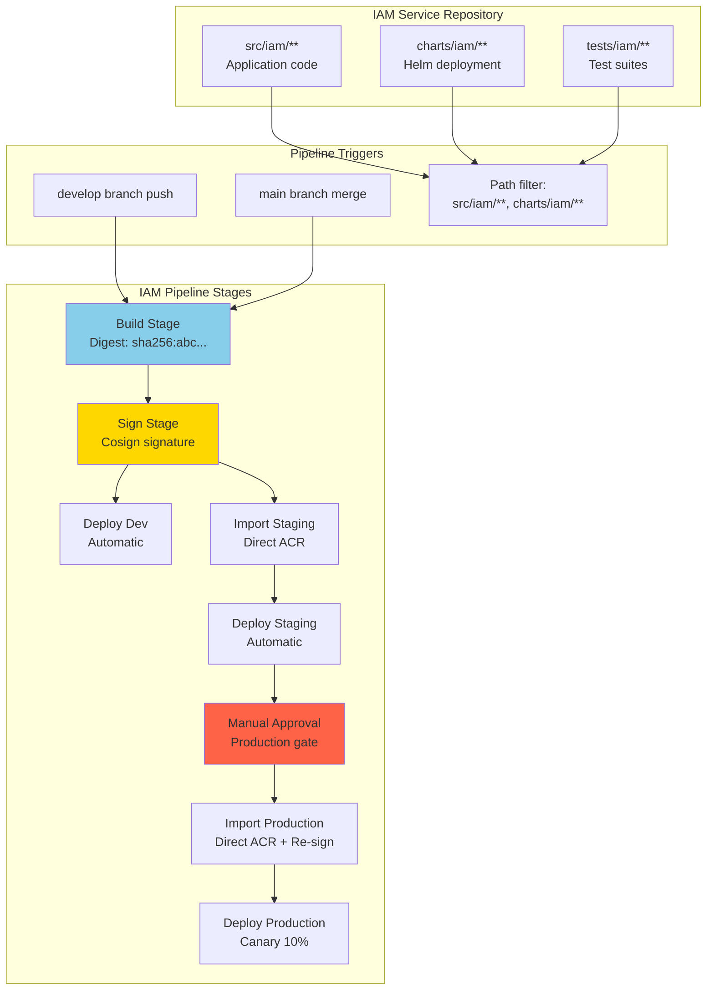

# Stage 2: IAM Service Pipeline

**Duration**: 10 days  
**Effort**: 1 engineer  
**Dependencies**: Stage 1 (Templates complete)

## Objectives

- Implement first service-specific pipeline (IAM as pilot)
- Validate template integration and reusability
- Establish path-based triggering for service isolation
- Create service-specific variable configuration
- Demonstrate complete Dev → Staging → Production flow
- Prove immutable digest pattern in real deployment

## Success Criteria

- [ ] IAM pipeline builds successfully
- [ ] Digest captured and tracked through all stages
- [ ] Cosign signing integrated and working
- [ ] Direct ACR import preserves digests
- [ ] Development deployment automatic on `develop` branch
- [ ] Staging deployment automatic on `main` branch merge
- [ ] Production deployment gated with manual approval
- [ ] Build time <25 minutes end-to-end
- [ ] Pipeline success rate >95%

## Architecture Overview



## Tasks Breakdown

### Task 2.1: Create IAM Service Variables (Day 1, 2 hours)

**Objective**: Define IAM-specific configuration

#### Implementation

Create `templates/variables/iam-variables.yml`:

```yaml
# templates/variables/iam-variables.yml
# IAM service-specific configuration
# Version: 1.0.0

variables:
  # ============================================================================
  # Service Identity
  # ============================================================================
  
  serviceName: 'iam'
  serviceDisplayName: 'Identity and Access Management'
  serviceOwner: 'platform-team@onestream.com'
  
  # ============================================================================
  # Source Code Paths
  # ============================================================================
  
  sourceCodePath: 'src/iam'
  dockerfilePath: 'src/iam/Dockerfile'
  dockerBuildContext: 'src/iam'
  
  # ============================================================================
  # Testing Configuration
  # ============================================================================
  
  unitTestPath: 'tests/iam/unit'
  integrationTestPath: 'tests/iam/integration'
  e2eTestPath: 'tests/iam/e2e'
  
  testResultsPath: '$(Build.ArtifactStagingDirectory)/test-results'
  codeCoverageEnabled: true
  codeCoverageThreshold: 80
  
  # ============================================================================
  # Helm Chart Configuration
  # ============================================================================
  
  helmChartPath: 'charts/iam'
  helmReleaseName: 'iam'
  
  # Development
  helmNamespaceDev: 'iam-poc'
  helmValuesDev: 'charts/iam/values-dev.yaml'
  
  # Staging
  helmNamespaceStaging: 'iam-staging'
  helmValuesStaging: 'charts/iam/values-staging.yaml'
  
  # Production
  helmNamespaceProd: 'iam-production'
  helmValuesProd: 'charts/iam/values-prod.yaml'
  
  # ============================================================================
  # Application Configuration
  # ============================================================================
  
  # IAM-specific application settings
  iamApiPort: 8080
  iamHealthEndpoint: '/health'
  iamReadinessEndpoint: '/ready'
  
  # Resource requirements
  cpuRequest: '250m'
  cpuLimit: '1000m'
  memoryRequest: '512Mi'
  memoryLimit: '2Gi'
  
  # Replica configuration
  replicasDev: 2
  replicasStaging: 3
  replicasProd: 5
  
  # ============================================================================
  # Build Configuration
  # ============================================================================
  
  # Docker build arguments (if needed)
  buildArgs: |
    NODE_ENV=production
    SERVICE_NAME=iam
  
  # Multi-stage build targets
  buildTarget: 'production'
  
  # ============================================================================
  # Deployment Strategy
  # ============================================================================
  
  # Rolling update configuration
  maxSurge: 1
  maxUnavailable: 0
  
  # Canary deployment (production only)
  canaryEnabled: true
  canaryPercentage: 10
  canaryDuration: 900  # 15 minutes
  
  # ============================================================================
  # Monitoring & Alerting
  # ============================================================================
  
  # Health check configuration
  healthCheckPath: '/health'
  healthCheckPort: 8080
  healthCheckInitialDelay: 30
  healthCheckPeriod: 10
  healthCheckTimeout: 5
  healthCheckFailureThreshold: 3
  
  # Readiness check configuration
  readinessCheckPath: '/ready'
  readinessCheckPort: 8080
  readinessCheckInitialDelay: 10
  readinessCheckPeriod: 5
  
  # ============================================================================
  # Security Configuration
  # ============================================================================
  
  # Run as non-root user
  runAsUser: 1000
  runAsGroup: 1000
  fsGroup: 1000
  
  # Security context
  allowPrivilegeEscalation: false
  readOnlyRootFilesystem: true
  
  # ============================================================================
  # Notification Configuration
  # ============================================================================
  
  # Teams/Slack notifications
  notificationChannel: 'iam-deployments'
  notificationEmail: 'iam-team@onestream.com'
```

#### Usage

The IAM pipeline will inherit both common and service-specific variables:

```yaml
variables:
- template: templates/variables/common-variables.yml
- template: templates/variables/iam-variables.yml
```

#### Validation

- [ ] Variable names follow naming convention
- [ ] No hard-coded secrets
- [ ] Resource limits appropriate for service
- [ ] Paths match actual repository structure

---

### Task 2.2: Create IAM Pipeline YAML (Day 1-2, 6 hours)

**Objective**: Implement complete IAM service pipeline

#### Implementation

Create `pipelines/iam-service-pipeline.yml`:

```yaml
# pipelines/iam-service-pipeline.yml
# IAM (Identity and Access Management) Service Pipeline
# Pilot implementation for OneStream pipeline refactoring
# Version: 1.0.0

# ============================================================================
# Trigger Configuration
# ============================================================================

trigger:
  branches:
    include:
    - develop      # Auto-deploy to Dev
    - main         # Auto-deploy to Staging
  paths:
    include:
    - src/iam/**           # IAM source code
    - charts/iam/**        # IAM Helm charts
    - tests/iam/**         # IAM tests
    - pipelines/iam-service-pipeline.yml
    - templates/**         # Template changes

pr:
  branches:
    include:
    - develop
    - main
  paths:
    include:
    - src/iam/**
    - charts/iam/**
    - tests/iam/**

# ============================================================================
# Variables
# ============================================================================

variables:
- template: ../templates/variables/common-variables.yml
- template: ../templates/variables/iam-variables.yml

# Pipeline-specific variables
- name: pocVersion
  value: 'poc-$(Build.BuildId)-$(echo $(Build.SourceVersion) | cut -c1-7)'

# ============================================================================
# Pipeline Name
# ============================================================================

name: 'IAM-$(Date:yyyyMMdd)$(Rev:.r)'

# ============================================================================
# Stages
# ============================================================================

stages:

# ============================================================================
# Stage: Build
# ============================================================================
- stage: Build
  displayName: 'Build IAM Container'
  jobs:
  
  - job: BuildContainer
    displayName: 'Build and capture digest'
    pool:
      vmImage: 'ubuntu-latest'
    timeoutInMinutes: $(jobTimeoutBuild)
    
    steps:
    - checkout: self
      fetchDepth: 1
      displayName: 'Checkout source code'
    
    - template: ../templates/steps/build-container.yml
      parameters:
        serviceName: $(serviceName)
        containerRegistry: $(containerRegistryDev)
        containerRegistryName: $(containerRegistryDevName)
        serviceConnection: $(serviceConnectionDev)
        dockerfilePath: $(dockerfilePath)
        buildContext: $(dockerBuildContext)
        buildArgs: $(buildArgs)
        enableCache: true

# ============================================================================
# Stage: Security Scan
# ============================================================================
- stage: SecurityScan
  displayName: 'Security Vulnerability Scan'
  dependsOn: Build
  condition: succeeded()
  jobs:
  
  - job: TrivyScan
    displayName: 'Trivy CVE scan'
    pool:
      vmImage: 'ubuntu-latest'
    variables:
      imageDigest: $[ stageDependencies.Build.BuildContainer.outputs['buildContainer.IMAGE_DIGEST'] ]
      imageTag: $[ stageDependencies.Build.BuildContainer.outputs['buildContainer.IMAGE_TAG'] ]
    
    steps:
    - task: AzureCLI@2
      displayName: 'Install Trivy'
      inputs:
        azureSubscription: $(serviceConnectionDev)
        scriptType: 'bash'
        scriptLocation: 'inlineScript'
        inlineScript: |
          set -euo pipefail
          wget -qO - https://aquasecurity.github.io/trivy-repo/deb/public.key | sudo apt-key add -
          echo "deb https://aquasecurity.github.io/trivy-repo/deb $(lsb_release -sc) main" | sudo tee -a /etc/apt/sources.list.d/trivy.list
          sudo apt-get update
          sudo apt-get install -y trivy
          trivy --version
    
    - task: AzureCLI@2
      displayName: 'Scan for vulnerabilities'
      inputs:
        azureSubscription: $(serviceConnectionDev)
        scriptType: 'bash'
        scriptLocation: 'inlineScript'
        inlineScript: |
          set -euo pipefail
          
          echo "Scanning image: $(containerRegistryDev)/$(imageTag)"
          
          # Authenticate to ACR
          az acr login --name $(containerRegistryDevName)
          
          # Run Trivy scan
          trivy image \
            --severity CRITICAL,HIGH \
            --exit-code 1 \
            --format table \
            --timeout 10m \
            "$(containerRegistryDev)/$(imageTag)"
          
          if [ $? -ne 0 ]; then
            echo "##vso[task.logissue type=error]Critical vulnerabilities found"
            exit 1
          fi
          
          echo "✅ Security scan passed"

# ============================================================================
# Stage: Sign
# ============================================================================
- stage: Sign
  displayName: 'Sign with Cosign'
  dependsOn: 
  - Build
  - SecurityScan
  condition: succeeded()
  jobs:
  
  - job: SignContainer
    displayName: 'Cryptographic signing'
    pool:
      vmImage: 'ubuntu-latest'
    variables:
      digestRef: $[ stageDependencies.Build.BuildContainer.outputs['buildContainer.DIGEST_REF'] ]
    
    steps:
    - template: ../templates/steps/cosign-sign.yml
      parameters:
        serviceName: $(serviceName)
        digestReference: $(digestRef)
        serviceConnection: $(serviceConnectionDev)
        keyVaultName: $(keyVaultName)
        signingKeyName: $(signingKeyDev)

# ============================================================================
# Stage: Deploy to Development
# ============================================================================
- stage: DeployDev
  displayName: 'Deploy to Development'
  dependsOn: Sign
  condition: |
    and(
      succeeded(),
      eq(variables['Build.SourceBranch'], 'refs/heads/develop')
    )
  jobs:
  
  - deployment: DeployToDevAKS
    displayName: 'Deploy IAM to Dev AKS'
    pool:
      vmImage: 'ubuntu-latest'
    environment: 'dev'
    timeoutInMinutes: $(jobTimeoutDeploy)
    variables:
      digestRef: $[ stageDependencies.Build.BuildContainer.outputs['buildContainer.DIGEST_REF'] ]
    
    strategy:
      runOnce:
        deploy:
          steps:
          - checkout: self
            fetchDepth: 1
          
          - template: ../templates/steps/deploy-with-verification.yml
            parameters:
              serviceName: $(serviceName)
              digestReference: $(digestRef)
              aksCluster: $(aksClusterDev)
              aksResourceGroup: $(aksResourceGroupDev)
              namespace: $(helmNamespaceDev)
              serviceConnection: $(serviceConnectionDev)
              keyVaultName: $(keyVaultName)
              signingKeyName: $(signingKeyDev)
              helmChartPath: $(helmChartPath)
              helmReleaseName: $(helmReleaseName)-dev
              healthCheckTimeout: $(healthCheckTimeout)

# ============================================================================
# Stage: Promote to Staging ACR
# ============================================================================
- stage: PromoteStaging
  displayName: 'Promote to Staging'
  dependsOn: Sign
  condition: |
    and(
      succeeded(),
      eq(variables['Build.SourceBranch'], 'refs/heads/main')
    )
  jobs:
  
  - job: ImportToStagingACR
    displayName: 'Import image to Staging ACR'
    pool:
      vmImage: 'ubuntu-latest'
    variables:
      digestRef: $[ stageDependencies.Build.BuildContainer.outputs['buildContainer.DIGEST_REF'] ]
    
    steps:
    - template: ../templates/steps/acr-direct-import.yml
      parameters:
        serviceName: $(serviceName)
        sourceRegistry: $(containerRegistryDev)
        targetRegistry: $(containerRegistryStaging)
        targetRegistryName: $(containerRegistryStagingName)
        digestReference: $(digestRef)
        serviceConnection: $(serviceConnectionPromotion)

# ============================================================================
# Stage: Deploy to Staging
# ============================================================================
- stage: DeployStaging
  displayName: 'Deploy to Staging'
  dependsOn: PromoteStaging
  condition: succeeded()
  jobs:
  
  - deployment: DeployToStagingAKS
    displayName: 'Deploy IAM to Staging AKS'
    pool:
      vmImage: 'ubuntu-latest'
    environment: 'staging'
    timeoutInMinutes: $(jobTimeoutDeploy)
    variables:
      # Use staging digest reference
      stagingDigestRef: $[ stageDependencies.PromoteStaging.ImportToStagingACR.outputs['importImage.TARGET_DIGEST_REF'] ]
    
    strategy:
      runOnce:
        deploy:
          steps:
          - checkout: self
            fetchDepth: 1
          
          - template: ../templates/steps/deploy-with-verification.yml
            parameters:
              serviceName: $(serviceName)
              digestReference: $(stagingDigestRef)
              aksCluster: $(aksClusterStaging)
              aksResourceGroup: $(aksResourceGroupStaging)
              namespace: $(helmNamespaceStaging)
              serviceConnection: $(serviceConnectionStaging)
              keyVaultName: $(keyVaultName)
              signingKeyName: $(signingKeyStaging)
              helmChartPath: $(helmChartPath)
              helmReleaseName: $(helmReleaseName)-staging
              healthCheckTimeout: $(healthCheckTimeout)

# ============================================================================
# Stage: Production Approval
# ============================================================================
- stage: ProductionApproval
  displayName: 'Production Approval Gate'
  dependsOn: DeployStaging
  condition: succeeded()
  jobs:
  
  - job: WaitForApproval
    displayName: 'Manual approval required'
    pool: server
    timeoutInMinutes: 1440  # 24 hours
    
    steps:
    - task: ManualValidation@0
      displayName: 'Approve Production Deployment'
      inputs:
        notifyUsers: '$(notificationEmail)'
        instructions: |
          Please review the staging deployment and approve production release.
          
          Staging Environment: https://iam-staging.onestream.com
          
          Verify:
          - All tests passed
          - Staging deployment successful
          - No critical issues reported
          
          Image Digest: $[ stageDependencies.Build.BuildContainer.outputs['buildContainer.IMAGE_DIGEST'] ]
        onTimeout: 'reject'

# ============================================================================
# Stage: Promote to Production ACR
# ============================================================================
- stage: PromoteProduction
  displayName: 'Promote to Production'
  dependsOn: ProductionApproval
  condition: succeeded()
  jobs:
  
  - job: ImportToProdACR
    displayName: 'Import image to Production ACR'
    pool:
      vmImage: 'ubuntu-latest'
    variables:
      stagingDigestRef: $[ stageDependencies.PromoteStaging.ImportToStagingACR.outputs['importImage.TARGET_DIGEST_REF'] ]
    
    steps:
    - template: ../templates/steps/acr-direct-import.yml
      parameters:
        serviceName: $(serviceName)
        sourceRegistry: $(containerRegistryStaging)
        targetRegistry: $(containerRegistryProd)
        targetRegistryName: $(containerRegistryProdName)
        digestReference: $(stagingDigestRef)
        serviceConnection: $(serviceConnectionPromotion)
  
  - job: SignProdImage
    displayName: 'Sign with Production key'
    dependsOn: ImportToProdACR
    pool:
      vmImage: 'ubuntu-latest'
    variables:
      prodDigestRef: $[ dependencies.ImportToProdACR.outputs['importImage.TARGET_DIGEST_REF'] ]
    
    steps:
    - template: ../templates/steps/cosign-sign.yml
      parameters:
        serviceName: $(serviceName)
        digestReference: $(prodDigestRef)
        serviceConnection: $(serviceConnectionProd)
        keyVaultName: $(keyVaultName)
        signingKeyName: $(signingKeyProd)

# ============================================================================
# Stage: Deploy to Production
# ============================================================================
- stage: DeployProduction
  displayName: 'Deploy to Production'
  dependsOn: PromoteProduction
  condition: succeeded()
  jobs:
  
  - deployment: DeployToProdAKS
    displayName: 'Deploy IAM to Production AKS'
    pool:
      vmImage: 'ubuntu-latest'
    environment: 'production'
    timeoutInMinutes: 30
    variables:
      prodDigestRef: $[ stageDependencies.PromoteProduction.ImportToProdACR.outputs['importImage.TARGET_DIGEST_REF'] ]
    
    strategy:
      # Canary deployment: 10% traffic for 15 minutes
      canary:
        increments: [10, 100]
        preDeploy:
          steps:
          - checkout: self
            fetchDepth: 1
        
        deploy:
          steps:
          - template: ../templates/steps/deploy-with-verification.yml
            parameters:
              serviceName: $(serviceName)
              digestReference: $(prodDigestRef)
              aksCluster: $(aksClusterProd)
              aksResourceGroup: $(aksResourceGroupProd)
              namespace: $(helmNamespaceProd)
              serviceConnection: $(serviceConnectionProd)
              keyVaultName: $(keyVaultName)
              signingKeyName: $(signingKeyProd)
              helmChartPath: $(helmChartPath)
              helmReleaseName: $(helmReleaseName)-prod
              healthCheckTimeout: $(healthCheckTimeout)
        
        postRouteTraffic:
          steps:
          - task: AzureCLI@2
            displayName: 'Monitor canary health'
            inputs:
              azureSubscription: $(serviceConnectionProd)
              scriptType: 'bash'
              scriptLocation: 'inlineScript'
              inlineScript: |
                set -euo pipefail
                
                echo "Monitoring canary deployment for $(canaryDuration) seconds..."
                
                DURATION=$(canaryDuration)
                INTERVAL=30
                ITERATIONS=$((DURATION / INTERVAL))
                
                for i in $(seq 1 $ITERATIONS); do
                  echo "Health check iteration $i of $ITERATIONS..."
                  
                  # Check pod health
                  az aks get-credentials \
                    --resource-group $(aksResourceGroupProd) \
                    --name $(aksClusterProd) \
                    --overwrite-existing
                  
                  # Get pod status
                  READY_PODS=$(kubectl get pods -n $(helmNamespaceProd) -l app=$(serviceName) -o jsonpath='{.items[*].status.conditions[?(@.type=="Ready")].status}' | grep -o "True" | wc -l)
                  TOTAL_PODS=$(kubectl get pods -n $(helmNamespaceProd) -l app=$(serviceName) --no-headers | wc -l)
                  
                  echo "Ready pods: $READY_PODS / $TOTAL_PODS"
                  
                  if [ $READY_PODS -lt 1 ]; then
                    echo "##vso[task.logissue type=error]No ready pods detected - canary unhealthy"
                    exit 1
                  fi
                  
                  sleep $INTERVAL
                done
                
                echo "✅ Canary health monitoring passed"
        
        on:
          failure:
            steps:
            - task: Kubernetes@1
              displayName: 'Rollback on failure'
              inputs:
                connectionType: 'Azure Resource Manager'
                azureSubscriptionEndpoint: $(serviceConnectionProd)
                azureResourceGroup: $(aksResourceGroupProd)
                kubernetesCluster: $(aksClusterProd)
                namespace: $(helmNamespaceProd)
                command: 'rollout'
                arguments: 'undo deployment/$(serviceName)'
```

#### Validation

- [ ] YAML syntax valid
- [ ] Triggers configured correctly (path-based)
- [ ] Variables inherited from templates
- [ ] Stage dependencies correct
- [ ] Output variables passed correctly
- [ ] Environment gates configured

---

### Task 2.3: Create IAM Helm Chart (Day 3-4, 8 hours)

**Objective**: Create Kubernetes deployment manifests for IAM

#### Implementation

Create `charts/iam/Chart.yaml`:

```yaml
apiVersion: v2
name: iam
description: Identity and Access Management service for OneStream
type: application
version: 1.0.0
appVersion: "1.0.0"
```

Create `charts/iam/values.yaml`:

```yaml
# Default values for IAM service
# This is a YAML-formatted file.

# ============================================================================
# Image Configuration
# ============================================================================
image:
  repository: onestreamdev.azurecr.io/iam
  pullPolicy: IfNotPresent
  # Digest will be overridden by pipeline
  digest: ""

# ============================================================================
# Service Configuration
# ============================================================================
service:
  name: iam
  type: ClusterIP
  port: 80
  targetPort: 8080

# ============================================================================
# Deployment Configuration
# ============================================================================
replicaCount: 2

strategy:
  type: RollingUpdate
  rollingUpdate:
    maxSurge: 1
    maxUnavailable: 0

# ============================================================================
# Resource Limits
# ============================================================================
resources:
  requests:
    cpu: 250m
    memory: 512Mi
  limits:
    cpu: 1000m
    memory: 2Gi

# ============================================================================
# Health Checks
# ============================================================================
livenessProbe:
  httpGet:
    path: /health
    port: 8080
  initialDelaySeconds: 30
  periodSeconds: 10
  timeoutSeconds: 5
  failureThreshold: 3

readinessProbe:
  httpGet:
    path: /ready
    port: 8080
  initialDelaySeconds: 10
  periodSeconds: 5
  timeoutSeconds: 3
  failureThreshold: 3

# ============================================================================
# Security Context
# ============================================================================
securityContext:
  runAsNonRoot: true
  runAsUser: 1000
  runAsGroup: 1000
  fsGroup: 1000
  allowPrivilegeEscalation: false
  readOnlyRootFilesystem: true
  capabilities:
    drop:
    - ALL

# ============================================================================
# Pod Security Standards
# ============================================================================
podSecurityContext:
  seccompProfile:
    type: RuntimeDefault

# ============================================================================
# Ingress Configuration
# ============================================================================
ingress:
  enabled: true
  className: nginx
  annotations:
    cert-manager.io/cluster-issuer: letsencrypt-prod
    nginx.ingress.kubernetes.io/ssl-redirect: "true"
  hosts:
  - host: iam.onestream.com
    paths:
    - path: /
      pathType: Prefix
  tls:
  - secretName: iam-tls
    hosts:
    - iam.onestream.com

# ============================================================================
# Service Account
# ============================================================================
serviceAccount:
  create: true
  annotations: {}
  name: iam

# ============================================================================
# Pod Disruption Budget
# ============================================================================
podDisruptionBudget:
  enabled: true
  minAvailable: 1

# ============================================================================
# Horizontal Pod Autoscaler
# ============================================================================
autoscaling:
  enabled: false
  minReplicas: 2
  maxReplicas: 10
  targetCPUUtilizationPercentage: 80
  targetMemoryUtilizationPercentage: 80

# ============================================================================
# Environment Variables
# ============================================================================
env:
- name: SERVICE_NAME
  value: "iam"
- name: LOG_LEVEL
  value: "info"
- name: PORT
  value: "8080"

# ============================================================================
# ConfigMap & Secrets
# ============================================================================
configMap:
  enabled: false
  data: {}

secrets:
  enabled: false
  data: {}

# ============================================================================
# Node Selector & Affinity
# ============================================================================
nodeSelector: {}

tolerations: []

affinity:
  podAntiAffinity:
    preferredDuringSchedulingIgnoredDuringExecution:
    - weight: 100
      podAffinityTerm:
        labelSelector:
          matchExpressions:
          - key: app
            operator: In
            values:
            - iam
        topologyKey: kubernetes.io/hostname
```

Create `charts/iam/templates/deployment.yaml`:

```yaml
apiVersion: apps/v1
kind: Deployment
metadata:
  name: {{ include "iam.fullname" . }}
  labels:
    {{- include "iam.labels" . | nindent 4 }}
spec:
  replicas: {{ .Values.replicaCount }}
  strategy:
    {{- toYaml .Values.strategy | nindent 4 }}
  selector:
    matchLabels:
      {{- include "iam.selectorLabels" . | nindent 6 }}
  template:
    metadata:
      annotations:
        prometheus.io/scrape: "true"
        prometheus.io/port: "8080"
        prometheus.io/path: "/metrics"
      labels:
        {{- include "iam.selectorLabels" . | nindent 8 }}
    spec:
      serviceAccountName: {{ include "iam.serviceAccountName" . }}
      securityContext:
        {{- toYaml .Values.podSecurityContext | nindent 8 }}
      containers:
      - name: {{ .Chart.Name }}
        securityContext:
          {{- toYaml .Values.securityContext | nindent 12 }}
        {{- if .Values.image.digest }}
        image: "{{ .Values.image.repository }}@{{ .Values.image.digest }}"
        {{- else }}
        image: "{{ .Values.image.repository }}:{{ .Values.image.tag | default .Chart.AppVersion }}"
        {{- end }}
        imagePullPolicy: {{ .Values.image.pullPolicy }}
        ports:
        - name: http
          containerPort: {{ .Values.service.targetPort }}
          protocol: TCP
        env:
        {{- toYaml .Values.env | nindent 10 }}
        livenessProbe:
          {{- toYaml .Values.livenessProbe | nindent 10 }}
        readinessProbe:
          {{- toYaml .Values.readinessProbe | nindent 10 }}
        resources:
          {{- toYaml .Values.resources | nindent 10 }}
        volumeMounts:
        - name: tmp
          mountPath: /tmp
      volumes:
      - name: tmp
        emptyDir: {}
      {{- with .Values.nodeSelector }}
      nodeSelector:
        {{- toYaml . | nindent 8 }}
      {{- end }}
      {{- with .Values.affinity }}
      affinity:
        {{- toYaml . | nindent 8 }}
      {{- end }}
      {{- with .Values.tolerations }}
      tolerations:
        {{- toYaml . | nindent 8 }}
      {{- end }}
```

Create `charts/iam/templates/service.yaml`:

```yaml
apiVersion: v1
kind: Service
metadata:
  name: {{ include "iam.fullname" . }}
  labels:
    {{- include "iam.labels" . | nindent 4 }}
spec:
  type: {{ .Values.service.type }}
  ports:
  - port: {{ .Values.service.port }}
    targetPort: http
    protocol: TCP
    name: http
  selector:
    {{- include "iam.selectorLabels" . | nindent 4 }}
```

Create `charts/iam/templates/_helpers.tpl`:

```yaml
{{/*
Expand the name of the chart.
*/}}
{{- define "iam.name" -}}
{{- default .Chart.Name .Values.nameOverride | trunc 63 | trimSuffix "-" }}
{{- end }}

{{/*
Create a default fully qualified app name.
*/}}
{{- define "iam.fullname" -}}
{{- if .Values.fullnameOverride }}
{{- .Values.fullnameOverride | trunc 63 | trimSuffix "-" }}
{{- else }}
{{- $name := default .Chart.Name .Values.nameOverride }}
{{- if contains $name .Release.Name }}
{{- .Release.Name | trunc 63 | trimSuffix "-" }}
{{- else }}
{{- printf "%s-%s" .Release.Name $name | trunc 63 | trimSuffix "-" }}
{{- end }}
{{- end }}
{{- end }}

{{/*
Create chart name and version as used by the chart label.
*/}}
{{- define "iam.chart" -}}
{{- printf "%s-%s" .Chart.Name .Chart.Version | replace "+" "_" | trunc 63 | trimSuffix "-" }}
{{- end }}

{{/*
Common labels
*/}}
{{- define "iam.labels" -}}
helm.sh/chart: {{ include "iam.chart" . }}
{{ include "iam.selectorLabels" . }}
{{- if .Chart.AppVersion }}
app.kubernetes.io/version: {{ .Chart.AppVersion | quote }}
{{- end }}
app.kubernetes.io/managed-by: {{ .Release.Service }}
{{- end }}

{{/*
Selector labels
*/}}
{{- define "iam.selectorLabels" -}}
app.kubernetes.io/name: {{ include "iam.name" . }}
app.kubernetes.io/instance: {{ .Release.Name }}
app: iam
{{- end }}

{{/*
Create the name of the service account to use
*/}}
{{- define "iam.serviceAccountName" -}}
{{- if .Values.serviceAccount.create }}
{{- default (include "iam.fullname" .) .Values.serviceAccount.name }}
{{- else }}
{{- default "default" .Values.serviceAccount.name }}
{{- end }}
{{- end }}
```

Create environment-specific value files:

`charts/iam/values-dev.yaml`:
```yaml
replicaCount: 2
resources:
  requests:
    cpu: 250m
    memory: 512Mi
ingress:
  hosts:
  - host: iam-dev.onestream.com
env:
- name: ENVIRONMENT
  value: "development"
```

`charts/iam/values-staging.yaml`:
```yaml
replicaCount: 3
resources:
  requests:
    cpu: 500m
    memory: 1Gi
ingress:
  hosts:
  - host: iam-staging.onestream.com
env:
- name: ENVIRONMENT
  value: "staging"
```

`charts/iam/values-prod.yaml`:
```yaml
replicaCount: 5
resources:
  requests:
    cpu: 1000m
    memory: 2Gi
ingress:
  hosts:
  - host: iam.onestream.com
env:
- name: ENVIRONMENT
  value: "production"
autoscaling:
  enabled: true
  minReplicas: 5
  maxReplicas: 20
```

#### Validation

- [ ] Helm chart lints successfully (`helm lint charts/iam`)
- [ ] Templates render correctly (`helm template charts/iam`)
- [ ] Digest-based image reference works
- [ ] Security contexts properly configured
- [ ] Health checks validated

---

### Task 2.4: Configure Azure DevOps Environments (Day 5, 4 hours)

**Objective**: Set up deployment environments with approval gates

#### Azure DevOps UI Configuration

1. **Navigate to Environments**:
   - Go to Pipelines → Environments
   - Create three environments: `dev`, `staging`, `production`

2. **Configure Production Approvals**:
   - Select `production` environment
   - Click "Approvals and checks"
   - Add "Approvals"
   - Add approvers (production-approvers group)
   - Set timeout: 24 hours
   - Instructions: "Review staging deployment before approving"

3. **Configure Branch Protection (Optional)**:
   - Add branch control to `production`
   - Allow only `main` or `release/*` branches

4. **Set Up Environment Secrets** (if needed):
   - Each environment can have specific secrets
   - Example: Different database connection strings per environment

#### Scripted Configuration (PowerShell)

Create `setup/configure-environments.ps1`:

```powershell
# configure-environments.ps1
# Configure Azure DevOps environments for IAM pipeline

param(
    [Parameter(Mandatory=$true)]
    [string]$OrganizationUrl,
    
    [Parameter(Mandatory=$true)]
    [string]$ProjectName,
    
    [Parameter(Mandatory=$true)]
    [string]$PAT
)

$headers = @{
    Authorization = "Basic " + [Convert]::ToBase64String([Text.Encoding]::ASCII.GetBytes(":$PAT"))
    "Content-Type" = "application/json"
}

$apiVersion = "7.1-preview.1"

# Create environments
$environments = @("dev", "staging", "production")

foreach ($env in $environments) {
    Write-Host "Creating environment: $env"
    
    $body = @{
        name = $env
        description = "$env environment for IAM service"
    } | ConvertTo-Json
    
    $uri = "$OrganizationUrl/$ProjectName/_apis/pipelines/environments?api-version=$apiVersion"
    
    try {
        $response = Invoke-RestMethod -Uri $uri -Method Post -Headers $headers -Body $body
        Write-Host "✅ Environment '$env' created (ID: $($response.id))"
        
        # Configure production approval
        if ($env -eq "production") {
            Write-Host "Configuring production approvals..."
            # Note: Approval configuration typically done via UI or separate API calls
            Write-Host "⚠️  Please configure production approvals manually in Azure DevOps UI"
        }
    }
    catch {
        Write-Host "❌ Failed to create environment '$env': $_"
    }
}

Write-Host ""
Write-Host "=========================================="
Write-Host "Environment Configuration Complete"
Write-Host "=========================================="
Write-Host "Next Steps:"
Write-Host "1. Configure production approvals in Azure DevOps UI"
Write-Host "2. Add deployment policies if needed"
Write-Host "3. Set up environment-specific variables"
```

#### Validation

- [ ] All three environments created
- [ ] Production environment requires approval
- [ ] Approver group configured
- [ ] Timeout set correctly
- [ ] Test pipeline can deploy to environments

---

### Task 2.5: Testing & Validation (Day 6-10, 20 hours)

**Objective**: Comprehensive testing of IAM pipeline

#### Test Plan

Create `testing/iam-pipeline-tests.md`:

```markdown
# IAM Pipeline Test Plan

## Test Environment Setup

- [ ] Development AKS cluster accessible
- [ ] Staging AKS cluster accessible
- [ ] Production AKS cluster accessible
- [ ] All ACRs configured
- [ ] Service connections verified
- [ ] Key Vault permissions granted

## Unit Tests

### T1: Build Stage

**Test**: Trigger pipeline on `develop` branch push
- [ ] Pipeline triggers automatically
- [ ] Container builds successfully
- [ ] Digest captured as output variable
- [ ] POC version generated correctly
- [ ] Build completes in <10 minutes

**Test**: Path-based triggering
- [ ] Changes to `src/iam/**` trigger pipeline
- [ ] Changes to `charts/iam/**` trigger pipeline
- [ ] Changes to unrelated paths do NOT trigger

### T2: Security Scan Stage

**Test**: Trivy vulnerability scan
- [ ] Trivy installs successfully
- [ ] Scan completes without errors
- [ ] Critical vulnerabilities block pipeline
- [ ] Scan results logged

### T3: Sign Stage

**Test**: Cosign signing
- [ ] Cosign installs
- [ ] Azure Key Vault authentication successful
- [ ] Image signed with dev key
- [ ] Signature attached to digest
- [ ] Verification passes

### T4: Deploy Dev Stage

**Test**: Development deployment
- [ ] Only triggers on `develop` branch
- [ ] Signature verified before deployment
- [ ] Helm chart deployed successfully
- [ ] Pods reach Ready state
- [ ] Health checks pass
- [ ] Digest reference in deployment matches built digest

### T5: Promote Staging Stage

**Test**: Staging ACR import
- [ ] Only triggers on `main` branch
- [ ] Image imported to staging ACR
- [ ] Digest preserved exactly
- [ ] Verification confirms digest match

### T6: Deploy Staging Stage

**Test**: Staging deployment
- [ ] Depends on successful import
- [ ] Uses staging digest reference
- [ ] Deployment successful
- [ ] Health checks pass

### T7: Production Approval Stage

**Test**: Manual approval gate
- [ ] Pipeline pauses for approval
- [ ] Notification sent to approvers
- [ ] Approval required to proceed
- [ ] Rejection stops pipeline

### T8: Promote Production Stage

**Test**: Production ACR import
- [ ] Image imported to production ACR
- [ ] Digest preserved
- [ ] Re-signed with production key
- [ ] Production signature verified

### T9: Deploy Production Stage

**Test**: Production canary deployment
- [ ] Canary deploys 10% traffic
- [ ] Health monitoring for 15 minutes
- [ ] Full rollout on success
- [ ] Automatic rollback on failure

## Integration Tests

### I1: End-to-End Develop Branch Flow
- [ ] Push to `develop` → Build → Sign → Deploy Dev
- [ ] Total time <25 minutes
- [ ] Digest tracked through all stages
- [ ] Deployment successful

### I2: End-to-End Main Branch Flow
- [ ] Merge to `main` → Build → Sign → Promote Staging → Deploy Staging
- [ ] Manual approval → Promote Prod → Deploy Prod
- [ ] Total time <30 minutes (excluding approval wait)
- [ ] Digest identical across all environments

### I3: Rollback Scenario
- [ ] Deploy bad version to production
- [ ] Canary health check fails
- [ ] Automatic rollback triggered
- [ ] Previous version restored
- [ ] Rollback completes in <5 minutes

## Performance Tests

### P1: Build Performance
- Target: <10 minutes
- Measured: _____ minutes
- Status: [ ] Pass [ ] Fail

### P2: Total Pipeline Performance (Dev)
- Target: <25 minutes
- Measured: _____ minutes
- Status: [ ] Pass [ ] Fail

### P3: Promotion Performance
- Target: <5 minutes per ACR import
- Measured: _____ minutes
- Status: [ ] Pass [ ] Fail

## Security Tests

### S1: Unsigned Image Blocked
- [ ] Remove signing step
- [ ] Deployment fails signature verification
- [ ] Unsigned image never deployed

### S2: Tampered Digest Detected
- [ ] Manually modify digest in deployment
- [ ] Verification fails
- [ ] Deployment blocked

### S3: Service Principal Permissions
- [ ] Dev SP cannot access production resources
- [ ] Staging SP has read-only ACR access
- [ ] Promotion SP can import but not deploy

## Documentation Tests

### D1: Template Documentation
- [ ] All templates documented
- [ ] Usage examples provided
- [ ] Parameter descriptions clear

### D2: Runbook Completeness
- [ ] Deployment runbook exists
- [ ] Rollback procedure documented
- [ ] Troubleshooting guide complete
```

#### Validation Scripts

Create `testing/validate-iam-deployment.sh`:

```bash
#!/usr/bin/env bash
# Validate IAM deployment health

set -euo pipefail

NAMESPACE=${1:-"iam-poc"}
SERVICE="iam"

echo "=========================================="
echo "IAM Deployment Validation"
echo "=========================================="
echo "Namespace: $NAMESPACE"
echo ""

# Check deployment exists
echo "Checking deployment..."
kubectl get deployment $SERVICE -n $NAMESPACE

# Check pod status
echo ""
echo "Checking pods..."
kubectl get pods -n $NAMESPACE -l app=$SERVICE

# Check service
echo ""
echo "Checking service..."
kubectl get svc $SERVICE -n $NAMESPACE

# Verify digest
echo ""
echo "Verifying image digest..."
DEPLOYED_IMAGE=$(kubectl get deployment $SERVICE -n $NAMESPACE -o jsonpath='{.spec.template.spec.containers[0].image}')
echo "Deployed image: $DEPLOYED_IMAGE"

if [[ $DEPLOYED_IMAGE != *"@sha256:"* ]]; then
    echo "❌ ERROR: Deployment not using digest reference!"
    exit 1
fi

echo "✅ Digest reference confirmed"

# Health check
echo ""
echo "Performing health check..."
POD=$(kubectl get pods -n $NAMESPACE -l app=$SERVICE -o jsonpath='{.items[0].metadata.name}')

kubectl exec $POD -n $NAMESPACE -- wget -q -O- http://localhost:8080/health || {
    echo "❌ Health check failed"
    exit 1
}

echo "✅ Health check passed"

echo ""
echo "=========================================="
echo "✅ Validation Complete"
echo "=========================================="
```

---

## Stage Completion Checklist

- [ ] **Task 2.1**: IAM service variables created and validated
- [ ] **Task 2.2**: IAM pipeline YAML complete and syntax-valid
- [ ] **Task 2.3**: Helm charts created and linted
- [ ] **Task 2.4**: Azure DevOps environments configured
- [ ] **Task 2.5**: All tests passed (unit, integration, performance, security)

## Deliverables

1. ✅ `templates/variables/iam-variables.yml`
2. ✅ `pipelines/iam-service-pipeline.yml`
3. ✅ `charts/iam/` (complete Helm chart)
4. ✅ Azure DevOps environments configured
5. ✅ `testing/iam-pipeline-tests.md`
6. ✅ `testing/validate-iam-deployment.sh`

## Success Metrics

| Metric | Target | Actual | Status |
|--------|--------|--------|--------|
| Build time | <10 min | ___ min | [ ] |
| Total pipeline (Dev) | <25 min | ___ min | [ ] |
| Security scan pass | 100% | ___ % | [ ] |
| Deployment success | >95% | ___ % | [ ] |
| Digest tracking | 100% | ___ % | [ ] |

## Lessons Learned

Document insights for replicating to other services:

- **What worked well**:
  - _[to be filled during implementation]_

- **Challenges encountered**:
  - _[to be filled during implementation]_

- **Improvements for next service**:
  - _[to be filled during implementation]_

## Next Stage

Proceed to [Stage 3: Digest Signing & Security](./stage-3-digest-signing.md) to enhance cryptographic signing and security validation.

---

**Stage 2 Complete** ✅
